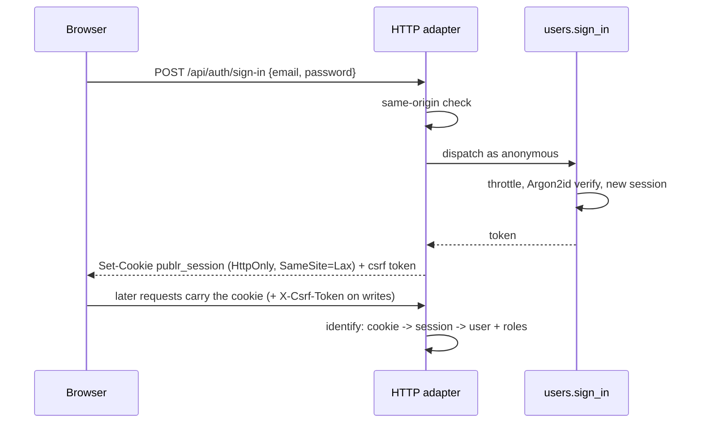

# Authentication

How people get in, and how Publr keeps everyone else out. The mechanics live in
operations (`project.init`, `users.sign_in`, `users.sign_out`,
`users.set_password`, ...) so the CLI, the HTTP routes and plugins all go
through the same doors; see [CLI: users](adapters/cli/user.md) and [REST API](rest.md)
for the surfaces.

## Signing in

Passwords are hashed with Argon2id and never stored. A session is a random
`id.secret` token; only a hash of the secret is stored, so a leaked database
does not leak sessions. Sessions slide (they extend on use) and expire after
thirty days of silence; signing out revokes them.

New accounts can be created with a password, with a generated one shown
once, or with no password at all: then the account is inactive until the
person redeems a one-hour, single-use set-password link (which an admin can
reissue at any time). Setting a password signs out every session of that
account.

Wrong passwords cost the same time as right ones and give the same answer for
unknown accounts, so nothing about who exists leaks. After a handful of
failures an account waits before it may try again, for longer each time (one
minute, then five, fifteen, sixty), and never permanently, so a stranger cannot
lock a real user out. Every attempt is announced as an event
(`auth.sign_in_failed`, `auth.sign_in_succeeded`, `auth.sign_in_throttled`) that
plugins can act on: alerts, CAPTCHA, IP rules, second factors, all belong in
plugins, not the core.

Browser requests that change something must come from the same origin and
carry a per-session CSRF token; requests without a browser cookie (the CLI,
API tokens) are unaffected.

A project has one set of accounts and one session for the admin and every app. When an
app answers on a subdomain ([Apps](apps.md#where-an-app-answers)), the session cookie is
set for the project's whole domain, so one sign-in holds everywhere. Two separate sets
of accounts are two projects.

## Roles

A role is data: a name, a label and **grants**. A grant names an operation
(`record.save`), a namespace and everything under it (`record.*`, `app.newsletter.*`),
or everything (`*`); a grant starting with `!` takes names back from the role. Nothing
is granted that no grant names. An account holds one or more roles and may call what any
of them grants. `role list` lists them.

Core declares two. `admin` holds `*`. `editor` holds the content: records and terms and
their history, reading the types and taxonomies, but not changing structure, users or
settings, and not purging. Settings singletons need `settings.edit`, a grant that names
no operation; `admin` holds it through `*`.

Every compiled-in plugin may declare roles of its own, or add grants to one that exists
(a plugin giving editors its operations declares `editor` with those grants). A role
stored on an account that no compiled-in code declares any more grants nothing.

Operations an app calls are named `app.<feature>.<verb>` (`app.newsletter.subscribe`),
the feature's own namespace: any app may call them. A role for an app's visitors grants
those (`app.newsletter.*`) and never the admin's (`newsletter.*`).

Short of a grant, a signed-in account gets what an anonymous visitor gets: live records
and terms of public types. An app's pages read those for any visitor, whatever their
roles; what is private to a visitor (their orders, their projects) an app reads through
its own operations, which decide what the visitor may see.

**The admin's door.** Only an account whose roles grant one of the admin's operations
(anything outside `app.*`, and not one open to everyone) gets in. Reading live public
content, which anyone may, does not count. The admin's sign-in
refuses anyone else, and every admin URL sends them back to it. So an app's visitor,
signed in through the app, never sees the admin, nor the site toolbar that leads there.
Only an admin grants roles (`user create`, `user update`).

Signing in, signing out, redeeming a set-password link and the one-time setup are open
to everyone. Finer rules (per-type access, owning records) are plugin policies, see
[Architecture: Permissions](architecture.md#permissions).

## Setup, exactly once

`publr init` creates the first admin. It works only while no admin exists and
the project has never been initialised; the fact is recorded in the database in
the same transaction, so deleting users later does not reopen it, and nobody
can run it again, not even the local operator. Anyone may call it, so run it
right away.

## What is deliberately not in the core

IP-based limits (the address is whatever a proxy says), CAPTCHA, second
factors, passkeys, SSO, breached-password checks, password expiry, permanent
lockouts, audit persistence. Every sign-in raises an event, so all of these are
plugins on `users.sign_in`, not core features.
