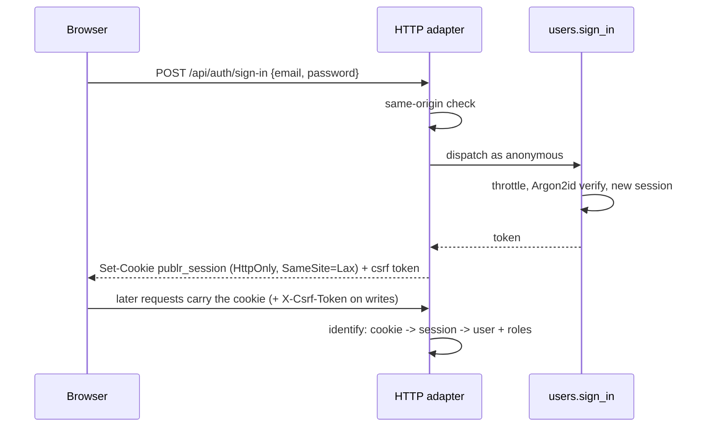
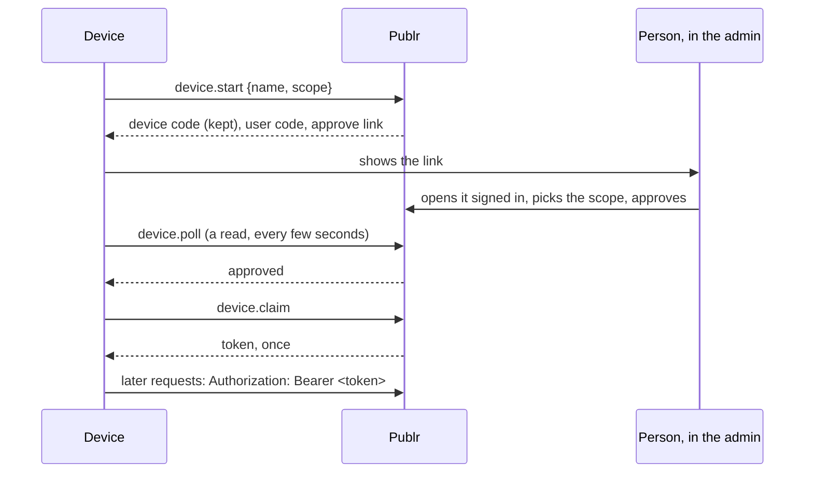

# Authentication

How people get in, and how Publr keeps everyone else out. The mechanics live in
operations (`project.init`, `users.sign_in`, `users.sign_out`,
`users.set_password`, ...) so the CLI, the HTTP routes and plugins all go
through the same doors; see [CLI: users](adapters/cli/user.md) and [REST API](rest.md)
for the surfaces.

## Signing in

Passwords are hashed with Argon2id and never stored. A session is a random
`id.secret` token; only a hash of the secret is stored, so a leaked database
does not leak sessions. Sessions slide (they extend on use) and expire after
thirty days of silence; signing out revokes them.

New accounts can be created with a password, with a generated one shown
once, or with no password at all: then the account is inactive until the
person redeems a one-hour, single-use set-password link (which an admin can
reissue at any time). Setting a password signs out every session of that
account.

Wrong passwords cost the same time as right ones and give the same answer for
unknown accounts, so nothing about who exists leaks. After a handful of
failures an account waits before it may try again, for longer each time (one
minute, then five, fifteen, sixty), and never permanently, so a stranger cannot
lock a real user out. Every attempt is announced as an event
(`auth.sign_in_failed`, `auth.sign_in_succeeded`, `auth.sign_in_throttled`) that
plugins can act on: alerts, CAPTCHA, IP rules, second factors, all belong in
plugins, not the core.

Browser requests that change something must come from the same origin and
carry a per-session CSRF token; requests without a browser cookie (the CLI,
a device's token) are unaffected.

A project has one set of accounts and one session for the admin and every app. When an
app answers on a subdomain ([Apps](apps.md#where-an-app-answers)), the session cookie is
set for the project's whole domain, so one sign-in holds everywhere. Two separate sets
of accounts are two projects.

## Signing in with a provider

A provider plugin (GitHub, Google, one folder each, compiled in) proves who someone is
and hands the core an identity: the provider's name, its stable id for the person, and
the email it reports, with whether it vouches for that email. The core keeps which
account each identity belongs to and never the provider's tokens: Publr signs people in,
it does not act on GitHub for them.

A button sends the browser to `/auth/<provider>`, which makes a `state` and a PKCE pair,
keeps them in a ten-minute cookie and redirects to the provider; the provider sends the
browser back to `/auth/<provider>/callback`, which checks the state and asks the plugin
who the code stands for. Every offered provider is listed by `identity.providers`, which
the admin's login page uses and an app's may. The callback is the request's own origin;
`PUBLR_AUTH_CALLBACK_ORIGIN` advertises another (a public host that sends the browser on to
a machine the providers cannot reach, during development).

`identity.sign_in`, called as the system by the provider's callback (an administrator may
call it too, and could sign in as anyone anyway), decides whose identity it is, in this
order:

1. The account it is linked to, by provider and id. Email is never the key: emails
   change and providers reuse them.
2. Otherwise, the active account with that email, which is linked on the way, but only
   when the provider vouches for the email. An unverified email links nothing.
3. Otherwise, nobody: `wrong email or password`, the same answer as a wrong password.
4. Unless an administrator opened sign-up (`identity configure --open_sign_up <role>`):
   then a new account with that role, still only from a verified email. The role is any
   declared one but `admin`. Sign-up is closed by default.

An account made this way has no password and may add one later; an account with a
password may link identities (`identity link`, by the system for a signed-in person) and
list or drop its own (`identity list`, `identity unlink`, which `editor` grants; an
administrator names any account). Someone signed in who goes through a provider button
links that identity to their account instead of starting a session. The last identity of an account
without a password cannot be dropped: that would lock the account out. Signing in through
a provider opens an ordinary session, with the same cookie, CSRF token, expiry and
sign-out; and it raises events like password sign-in (`auth.identity_signed_in`,
`auth.identity_linked`, `auth.identity_refused`, `auth.identity_unlinked`).

## Devices

A device is an agent or a tool that a person lets act for their account: the CLI on
another machine, an agent in a terminal, a chat app. It signs in by link, never with a
password or a pasted token.

`publr login <address>` does all of this. The token is `id.secret`; only the hash of the
secret is stored. A device never expires: its person, or an administrator, revokes it
under **Settings › Devices**, and it stops working at once.

A device acts as its account, with that account's roles, narrowed by the **scope** its
person approved:

| Scope | What the device may do |
|---|---|
| `read` | read what its account may read |
| `drafts` | write as its account may, but nothing visitors see changes: a write that publishes or unpublishes something (a `*.published` or `*.unpublished` notice) is refused whole, so edits wait as drafts for a person |
| `write` | everything its account may |

Whatever its scope, a device never destroys data for good. An operation that declares
`destroys` (deleting a content type, a taxonomy, a field group or a user; purging a
record or a term; removing a plugin; pruning snapshots; deleting media) is refused to it
with `NeedsPerson`, and a person does it in the admin. A device never approves another
device, and a request carrying its token needs no CSRF token (no browser sends it on its
own). Its changes are logged as `token:<id>`, and the activity log names the device.

A trusted issuer (a Publr Cloud dashboard) may also get a device's token for one of its
people with a sign-on token it signs (`device.redeem`), the trust `sign_on` already
gives it: that is how a chat app reaches a Cloud project over MCP. Approving or revoking
a device is announced (`auth.device_approved`, `auth.device_revoked`).

## Roles

A role is data: a name, a label and **grants**. A grant names an operation
(`record.save`), a namespace and everything under it (`record.*`, `app.newsletter.*`),
or everything (`*`); a grant starting with `!` takes names back from the role. Nothing
is granted that no grant names. An account holds one or more roles and may call what any
of them grants. `role list` lists them.

Core declares two. `admin` holds `*`. `editor` holds the content: records and terms and
their history, reading the types and taxonomies, but not changing structure, users or
settings, and not purging. Settings singletons need `settings.edit`, a grant that names
no operation; `admin` holds it through `*`.

Every built-in plugin may declare roles of its own, or add grants to one that exists
(a plugin giving editors its operations declares `editor` with those grants). A role
stored on an account that no built-in plugin declares any more grants nothing.

Operations an app calls are named `app.<feature>.<verb>` (`app.newsletter.subscribe`),
the feature's own namespace: any app may call them. A role for an app's visitors grants
those (`app.newsletter.*`) and never the admin's (`newsletter.*`).

Short of a grant, a signed-in account gets what an anonymous visitor gets: live records
and terms of public types. An app's pages read those for any visitor, whatever their
roles; what is private to a visitor (their orders, their projects) an app reads through
its own operations, which decide what the visitor may see.

**The admin's door.** Only an account whose roles grant one of the admin's operations
(anything outside `app.*`, and not one open to everyone) gets in. Reading live public
content, which anyone may, does not count. The admin's sign-in
refuses anyone else, and every admin URL sends them back to it. So an app's visitor,
signed in through the app, never sees the admin, nor the site toolbar that leads there.
Only an admin grants roles (`user create`, `user update`).

Signing in, signing out, redeeming a set-password link and the one-time setup are open
to everyone. Finer rules (per-type access, owning records) are plugin policies, see
[Architecture: Permissions](architecture.md#permissions).

## Setup, exactly once

`publr init` creates the first admin. It works only while no admin exists and
the project has never been initialised; the fact is recorded in the database in
the same transaction, so deleting users later does not reopen it, and nobody
can run it again, not even the local operator. Anyone may call it, so run it
right away.

## What is deliberately not in the core

IP-based limits (the address is whatever a proxy says), CAPTCHA, second
factors, passkeys, SSO, breached-password checks, password expiry, permanent
lockouts, audit persistence, and the providers themselves. Every sign-in raises
an event, so all of these are plugins on `users.sign_in`, not core features; a
provider is a plugin that hands `identity.sign_in` an identity.
