# The map

How Publr is put together, one idea at a time. Each idea is one small
diagram. At the end they are put together into the whole.

## Part 1: from the outside

### What Publr is

Editors write content in Publr; readers get the published part of it.
Everything is one program and one database file.

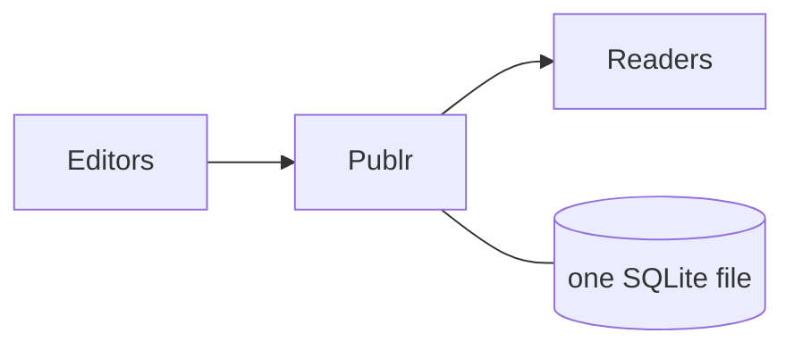

### Three doors, one room

There are three ways to use it. They are fronts on the same thing: anything
one can do, the others can do too.

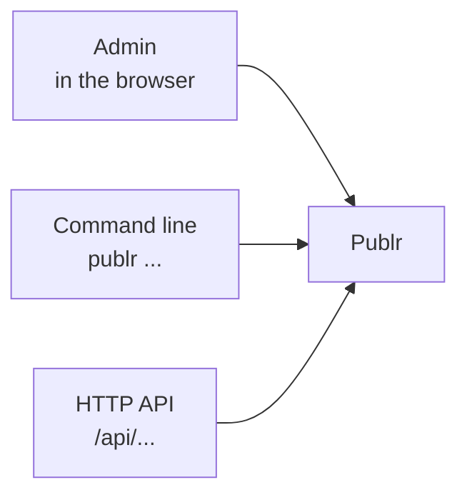

### One action

An action is called an **operation**. It takes an input, does one thing,
gives an output. `record publish` takes a record id and answers with the new
status.

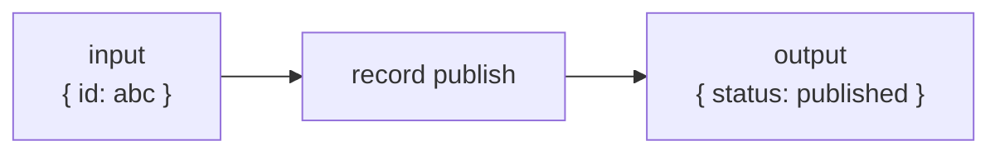

### The same action from each door

Each door just collects the input in its own way (a form, flags, JSON) and
runs the same operation.

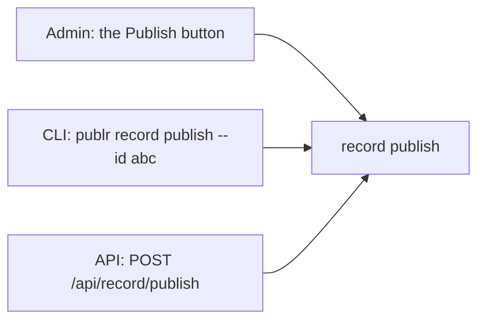

### Operations come in families

About thirty operations, grouped by what they act on. `publr --help` lists
them; the API and the admin offer the same list.

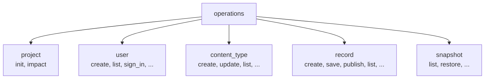

## Part 2: what happens when an operation runs

Every operation, from every door, goes through the same four steps.

### Step 1: who is asking

The door works this out (from the session cookie, or the `--as` flag on the
command line) before anything else happens.

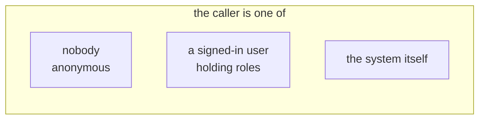

### Step 2: may they

A few rules decide what this caller may do with this operation. A signed-in user
may call what one of its roles grants; roles are data, core's and the plugins'.
Plugins can add rules of their own.

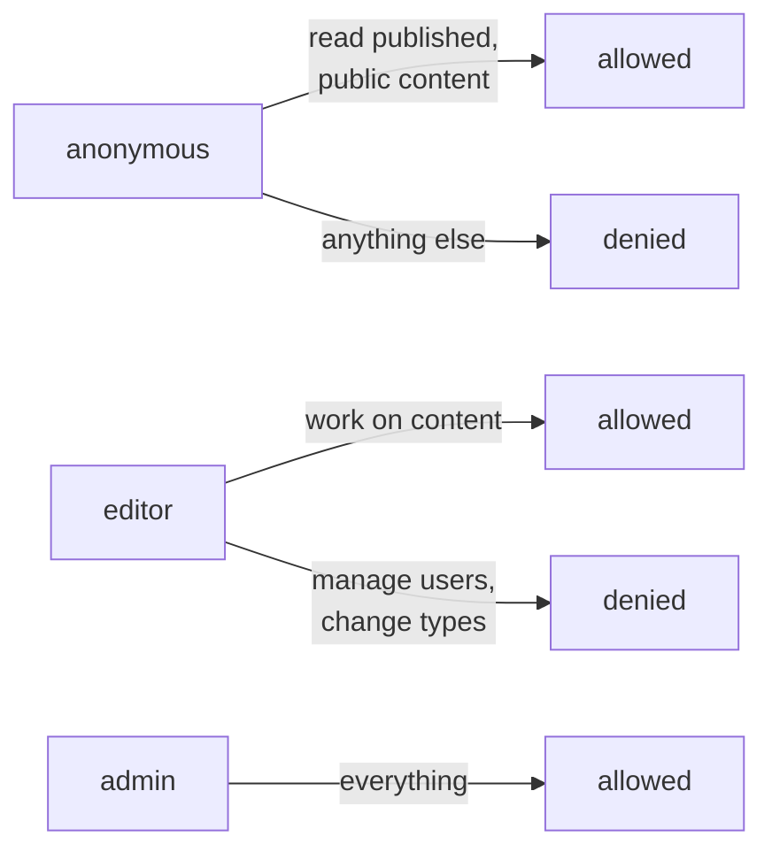

### Step 3: run it, all or nothing

The operation's code runs inside one database transaction. It either fully
happens or leaves no trace.

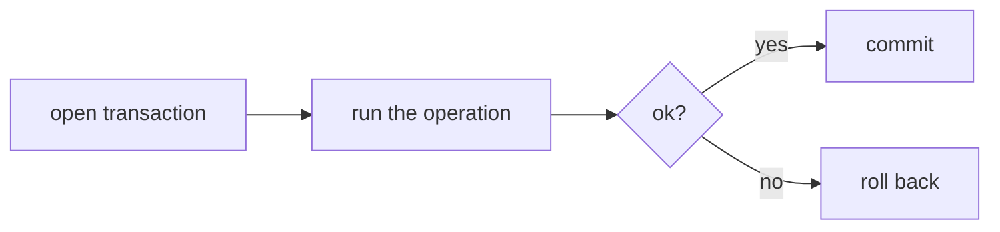

### Step 4: tell whoever listens

When it is done, a named event goes out. Plugins can react (send a webhook,
rebuild a page).

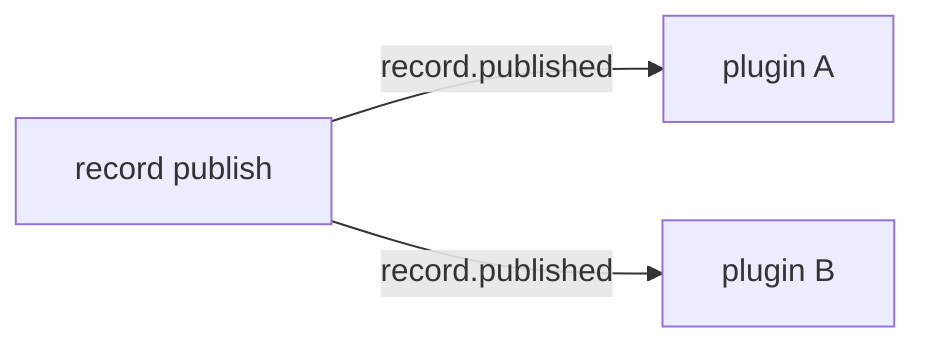

### Put together: the pipeline

This pipeline is one function, `dispatch` in `src/sdk.zig`. Every call
goes through it. If you read one piece of code, read that one.

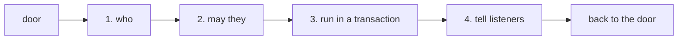

## Part 3: what the content is

### A content type

A content type is a schema: a name and a list of fields, each of a kind.
You make them in the admin (or the CLI); a plugin can declare its own in
code.

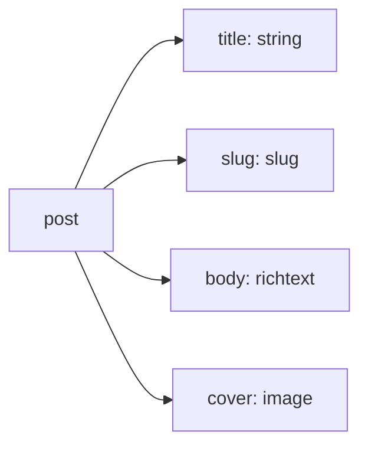

### A record

A record is one piece of content of a type: a status plus a value for each
field.

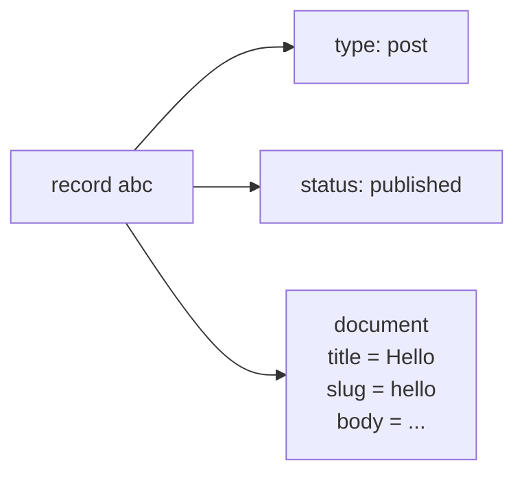

### A record's life

Four statuses. Readers only ever see `published`. Every move can be undone;
`record purge` is the only thing that removes a record for good.

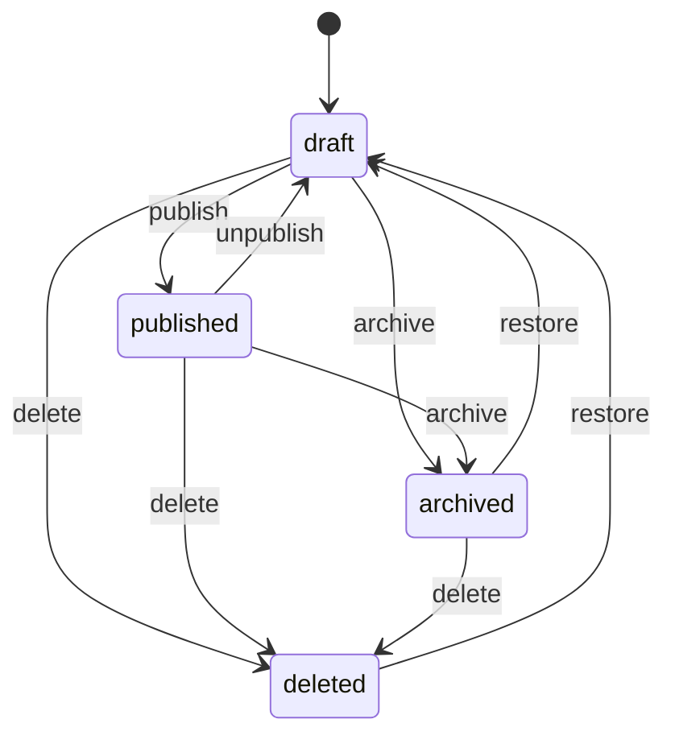

### Editing something that is published

Saving a published record does not change what readers see. The edit is
parked as a pending copy and the record is marked **changed**. Publish makes
the copy live; discard drops it. Unpublishing or archiving keeps the copy.

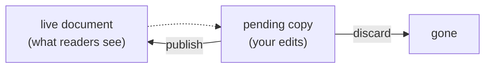

### History

Every time a live document is replaced, the old one is kept as a
**snapshot**. You can view them and restore one (which is itself a normal
edit).

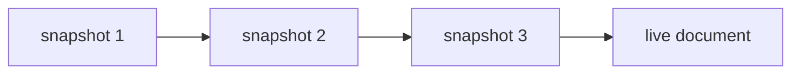

### Put together: how that is stored

Three tables hold all content: the types, one row per record, and one row
per field value (under a slot: `live` or `pending`). Snapshots are beside
them. Users, sessions and settings have their own small tables. Columns are
in [Database schema](schema.md).

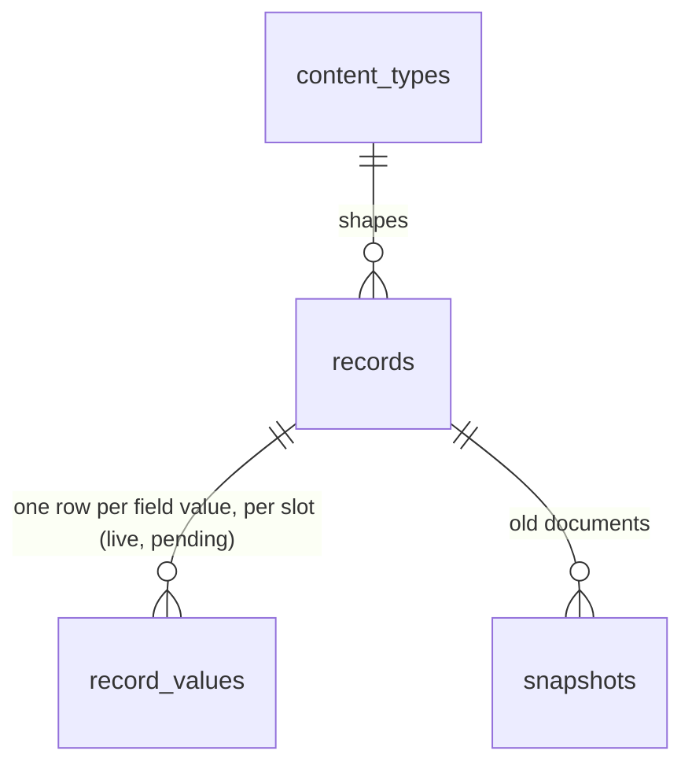

## Part 4: the code

### The layers

The directories are the story in order. Each layer only calls the one below
it.

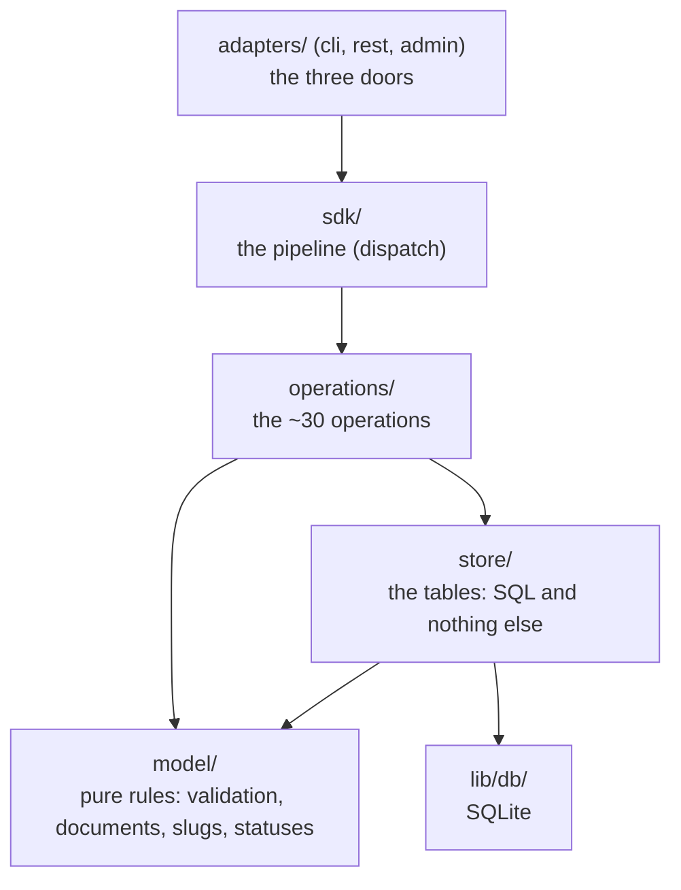

### Every file is one kind of thing

That is the rule the layout enforces, and `tidy` checks it (`scripts/tidy/kinds.zig`).
The directory tells you what a file is, what it may import, and how it is tested:

| kind | directory | is | may import | tested by |
|---|---|---|---|---|
| model | `model/` | pure rules: data in, data out. No database, no HTTP | `std`, other model files | unit tests, table-driven |
| store | `store/` | one table per file; functions are statements | `lib/db/`, `model/` | against a fixture database |
| operation | `operations/` | orchestration: grant, store, model, notices; never SQL | `sdk/`, `store/`, `model/` | scenarios through `dispatch` |
| adapter | `adapters/{cli,rest,admin,apps}/` | outside format in, operation call, outside format out; never the store | `sdk/`, operations | request in, response out |
| engine | `template/` | the `.publr` template language: read into a tree, typed, rendered against a context the apps adapter supplies. No database, no HTTP | `std` | unit tests against a stand-in context |
| pipeline | `sdk/` (+ `sdk/plugin/`) | dispatch, callers, grants, hooks, the plugin contract | `lib/`, `model/` | unit tests |
| wiring | `server/` | starting up: open the database, the registry of everything, the route table, the project handle, `serve`, `build`, wasm | everything | the http flow tests |
| library | `lib/{db,http,auth}/` | mechanisms that know nothing about content: SQLite, an HTTP server, password hashing | each other, `std` | unit tests |

Two adapters are allowed to read the store, because they are where a request
becomes a caller: `adapters/rest/identity.zig` (cookie to caller) and `adapters/cli.zig`
(`--as` to caller).

The fourth door faces the other way: `adapters/apps/` is what readers get, each app's
templates rendered through `record` operations (anonymous when shared, as the
signed-in visitor per request), built to files and rebuilt from the dependency index
(`lib/deps/`) when a `record.*` notice raises a key (`operations/project/changes.zig`).
A request goes to the app mounted where it asked. See [Apps](apps.md).

### Beside the layers

`lib/auth/` is used by the doors to work out who is asking; `lib/http/`
carries the API and admin doors; `sdk/plugin/` feeds rules, listeners and
types into the pipeline. Installed plugins reach it at run time instead:
`server/sandboxed_plugins/` runs them in the sandbox (`lib/wasm/`) behind `sdk/sandboxed_plugins.zig`, and
their calls come back through the same dispatch. Starting up lives in `main.zig`, `server/serve.zig`, `server.zig`
(`server/wasm.zig` is the same program as WebAssembly).

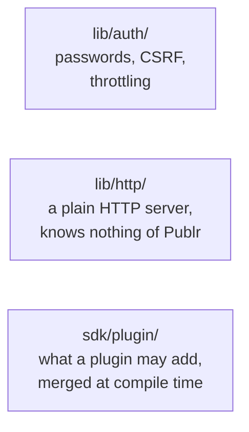

### The whole thing

All of the above in one picture: the doors on top, fed by `lib/auth/` (who is
asking) and carried by `lib/http/`; the pipeline in the middle, fed by
`sdk/plugin/`;
the operations, the content rules and the database below.

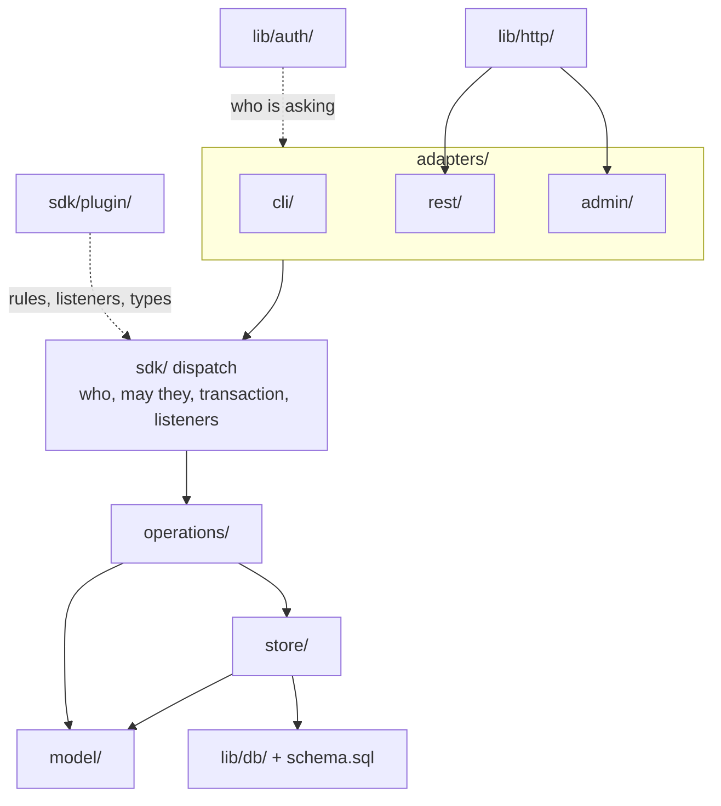

### One button, all the way down

The "Publish changes" button in the admin, through every layer:

1. `adapters/admin/content.zig:action` reads the form and checks it came from our own
   page (same origin, CSRF token).
2. It calls `dispatch` with `record.publish` and `{ id, expected_version }`.
3. `dispatch` (`sdk.zig`) asks the rules (an editor may write records),
   opens a transaction, calls the operation.
4. `record.publish` (`operations/record/lifecycle.zig`) loads the record, checks
   the parked slug is still free, keeps the old live document as a snapshot
   (`store/snapshots.zig`), renames the `pending` slot to `live`
   (`store/values.zig`), bumps the record with `changed` off
   (`store/records.zig`).
5. Commit, `record.published` goes to listeners, redirect back to the record.

## Part 5: reference

### Every file, one line

Grouped by kind. Lines are the whole file, tests included.

#### Entry points
| File | Lines | What |
|---|---|---|
| `main.zig` | 228 | `publr [--db] <cmd>`: `serve`, `build`, `zig`, `plugin build`, `agents`, `check-apps` or the CLI |
| `server/serve.zig` | 510 | `publr serve`: open the database and the apps, run the HTTP server loop with the rebuild queue between ticks; refuse to run beside another server, leave the session the CLI finds |
| `server/build.zig` | 221 | `publr build`: every app as files |
| `server/toolchain.zig` | 124 | `publr zig`: the compiler and the SDK plugins build against, written out once per machine at `init` and `serve` (a warning when they cannot be), run as a child process |
| `server/agents.zig` | 37 | `publr agents`: the guide for agents (`docs/agents.md`), this machine's SDK path, the permission catalog |
| `server/apps_host.zig` | 135 | The apps `serve` holds: read from the folder (or the build's own), opened, loaded again on `apps load` |
| `server/apps_load.zig` | 126 | `publr apps load` and `/_publr/apps/load`: the apps swapped into the running server, or checked here |
| `server/operator.zig` | 304 | While `serve` runs: its session beside the database, the CLI sending it commands (`/_publr/cli`), and running a command there or here (`Commands`) |
| `server/plugin_build.zig` | 336 | `publr plugin build`: a plugin's source compiled, its manifest read from the module in the sandbox and written in, then added and enabled or applied as its next version |
| `server.zig` | 111 | `Server`: open the database, apply schema and plugin bootstrap, open the dependency index, hold auth state |
| `server/wasm.zig` | 325 | The same program as a wasm reactor: init, import a db, answer one request |
| `publr.zig` | 69 | The library root: re-exports every module (what plugins import as `publr`) |
| `server/registry.zig` | 74 | Core + plugin operations/namespaces/policies/hooks/types/roles, the `SDK`, the status and role registries, bootstrap |
| `server/routes.zig` | 288 | The route table (`/api/auth/*`, `/api/health`, admin, rest, the apps as the fallback) and a `testing.Flow` that drives the full router |
| `server/project.zig` | 130 | `Project`: the per-process handle handlers get (`connection`, `auth`, static dir, the loaded apps, the domain), which app a request is for, the session cookie's domain |
| `server/sandboxed_plugins.zig` | 248 | The installed plugins the server holds: the sandbox's runtime, every plugin loaded from its row and file, the hook and operation index, the roles plugins declare |
| `server/sandboxed_plugins/interface.zig` | 375 | The `sdk.plugins.Plugins` every context carries: find and run a plugin's operation, run its hooks, read a module to install, reload after a change |
| `server/sandboxed_plugins/invoke.zig` | 316 | One call into a plugin, as itself and within its limits; the host functions it may call (`publr_call`, `publr_notice`, `publr_log`) |
| `server/sandboxed_plugins/loaded.zig` | 179 | One installed plugin: its module, manifest, grants, own types, content access, limits, and its disposable instance |
| `server/sandboxed_plugins/files.zig` | 224 | Modules on the data drive by their hash, uploads arriving in pieces, the sweep of files no row names |
| `server/sandboxed_plugins/scenarios.zig` | 518 | The sandbox end to end on the fixture plugins: install, call, revoke, update, remove, the admin's pages |

#### template/ (the template engine)
| File | Lines | What |
|---|---|---|
| `template.zig` | 1897 | `Program`: every template read, the route and island tables, the classes; `load` with its limits and diagnostics; the engine's tests against a stand-in context |
| `template/ast.zig` | 338 | What a template is once read: typed expressions, nodes, the template's facts |
| `template/routes.zig` | 198 | `content/` paths to route patterns, matching, substitution |
| `template/compile.zig` | 623 | The compiler's context and driver: names, paths, island keys, node lists |
| `template/frontmatter.zig` | 1094 | Imports and the Publr API reads, with the static/dynamic inference |
| `template/markup.zig` | 615 | Tags, attributes, children, `/_app/` URLs, minifying |
| `template/blocks.zig` | 165 | `{...}` in child position: loops, conditionals, values |
| `template/components.zig` | 745 | Component call sites: embed, island, PJSX |
| `template/expression.zig` | 946 | The typed expression parser and the text helpers |
| `template/render.zig` | 779 | `Renderer(Ctx)`: the tree evaluated against a context |
| `template/impact.zig` | 484 | Which pages and fragments of a program read a type |

#### adapters/apps/ (the fourth door: readers)
| File | Lines | What |
|---|---|---|
| `adapters/apps.zig` | 1049 | The dispatcher (the app mounted where a request asked, then its assets, islands or pages), the caching policy, `ETag`/304; the apps' integration tests |
| `adapters/apps/spec.zig` | 361 | Every compiled-in app as data, read off the generated `apps` module at compile time: name, mount, roles, templates, assets, tokens, interactive components, middleware |
| `adapters/apps/state.zig` | 439 | `App`: one app loaded, its stylesheet from the JIT, its fingerprint and assets, its address and output folder; `check_apps` |
| `adapters/apps/folder.zig` | 318 | Apps read from a project's folder at runtime: `app.zon`, templates, the build's checks; compiled parts from the build's app of the same name |
| `adapters/apps/load.zig` | 47 | Every app loaded into the project, and released |
| `adapters/apps/fingerprint.zig` | 263 | The generated assets' fingerprint and the build stamp |
| `adapters/apps/context.zig` | 1027 | The Publr API a template reads, over `record.list|get` (anonymous when shared, the visitor per request, nobody to an app whose roles it lacks); `Deps` recording |
| `adapters/apps/pages.zig` | 266 | A page served from the build or rendered now; the app's 404 |
| `adapters/apps/islands.zig` | 268 | One fragment, or a batch of dynamic ones |
| `adapters/apps/assets.zig` | 100 | `<mount>/_app/<path>`: generated code and the stylesheet from memory, public files from disk |
| `adapters/apps/build.zig` | 444 | The static build of one app or all, the sitemap |
| `adapters/apps/artifacts.zig` | 127 | Built files: their names in the index (`<app>:<url>`), their paths, reading and writing them |
| `adapters/apps/rebuild.zig` | 314 | The project's rebuild: `refresh` at startup, `flush` between ticks, each batch's artifacts sent to their app |
| `adapters/apps/rerender.zig` | 233 | One artifact rendered again, removed or forgotten; a changed record's own pages |
| `adapters/apps/middleware.zig` | 278 | An app's `middleware.zig`: the request it sees (the path inside the app) and the answer it gives |
| `adapters/apps/islands.js` | | The island loader: `<publr-island>` fetches its fragment and replaces itself |
| `operations/project/changes.zig` | 91 | The `on` middleware: every `record.*` notice raises the record's keys in the index |
| `lib/deps.zig` | 16 | The face on `publr_deps` |
| `lib/time.zig` | 32 | Dates as text |

#### model/ (pure)
| File | Lines | What |
|---|---|---|
| `model/field.zig` | 299 | Field kinds, options, `Def`, validation of field definitions |
| `model/content_type.zig` | 153 | A content type `Def`, its validation, JSON encode/decode, id from handle |
| `model/validate.zig` | 416 | A JSON document against a type's fields: problems |
| `model/document.zig` | 487 | A document as rows and back: `flatten` (object to rows, dotted paths, ordinals), `assemble` (rows to object), title and slug rules, path lookup |
| `model/status.zig` | 189 | The status registry (`draft/published/archived/deleted`, transitions), extensible by plugins |
| `model/convert.zig` | 159 | Value conversion when a field changes kind |
| `model/evolution.zig` | 200 | Diff two type definitions into a plan (removed, converted, needs rewrite) |
| `model/account.zig` | 65 | Email normalisation, display-name rule |
| `model/role.zig` | 373 | A role (name, label, grants), grant matching (`record.*`, `!record.purge`), the core roles, merging the plugins' |
| `model/permission.zig` | 310 | The permission catalog: keys, sentences, tiers and the operations each stands for; what every plugin gets and what none ever does |
| `model/sandboxed_plugin.zig` | 376 | A plugin's manifest as data; what it asks for and at which tier, what installing grants, when an update waits, its limits |
| `model/app.zig` | 433 | An app's `app.zon`: mounts, their validation, which app a host and path go to, an app's address |
| `model/view.zig` | 204 | A saved view's filters: the JSON shape, its bounds, `me` and relative days |
| `model/filter.zig` | 473 | The filter registry: keys, labels, operators, what each takes, how a clause constrains the list |

#### store/ (SQL only)
| File | Lines | What |
|---|---|---|
| `store/tables.zig` | 40 | The two document domains and the tables each owns (`records`, `terms`) |
| `store/definitions.zig` | 280 | A definitions table (`content_types`, `taxonomies`), generic over the domain: insert/update/get/list/delete |
| `store/documents.zig` + `documents/list.zig` | 260 + 330 | A documents table (`records`, `terms`): the `Record` row, insert/get/save/set_status/delete/rename, and the composed list query |
| `store/document_values.zig` | 400 | A values table + its search index: write flattened rows per slot, read, promote, lookups, delete by field |
| `store/content_types.zig`, `store/records.zig`, `store/values.zig` | 60, 230, 350 | The record domain's instantiations, with their tests; `values.zig` also writes the assignments of `terms` fields |
| `store/taxonomies.zig`, `store/terms.zig`, `store/term_values.zig` | 50, 250, 60 | The term domain's instantiations; `terms.zig` adds the parent: `parent_of`, `set_parent`, `ancestors`, `nodes` |
| `store/record_terms.zig` | 380 | `record_terms`: a record's membership per slot and field, ancestors included; promote, rebuild after a move |
| `store/snapshots.zig` | 182 | `snapshots` table: take/get/list/prune |
| `store/views.zig` | 226 | `views` table: a user's saved views, insert/get/list/update/delete |
| `store/sandboxed_plugins.zig` | 161 | `sandboxed_plugins` table: one row per installed plugin, get/list/count/put/delete |
| `store/users.zig` | 414 | `users` table: insert/find/list/tokens/password, the account's roles read with it |
| `store/user_roles.zig` | 106 | `user_roles` table: the roles an account holds, set whole; how many hold one |
| `store/sessions.zig` | 324 | `sessions` table: create/validate/slide/destroy, per-user cap |
| `store/identities.zig` | 220 | `identities` table: a provider's user linked to an account; find/insert/touch/of_user/delete |
| `store/settings.zig` | 54 | `settings` key/value get/set |

#### operations/ (the features)
| File | Lines | What |
|---|---|---|
| `operations/heartbeat.zig` | 63 | `heartbeat check` |
| `operations/project.zig` | 159 | `project init` (first admin), `project status` |
| `operations/project/impact.zig` | 213 | `project impact`: what the index holds for a record or its type |
| `operations/role.zig` | 48 | `role list` |
| `operations/user.zig` | 540 | `user create/list/password_link/set_password` |
| `operations/sign_in.zig` | 188 | `user sign_in/sign_out`: throttle, session |
| `operations/status.zig` | 51 | `status list` |
| `operations/document.zig` + `document/*.zig` | 60 + 1600 | One implementation of document CRUD for both domains: `access` (grant-checked load, statuses), `document` (parse, assemble, unique slug, revisions), `crud` (create/get/save/list/referrers/validate), `lifecycle` (transition/publish/discard/delete/purge), `definition` (find, create/update/get/list/delete/validate with evolution) |
| `operations/content_type.zig` | 250 | `content_type create/update/get/list/delete/validate`, declared over the record domain |
| `operations/record.zig` | 900 | The record domain (`document.Domain`), `record create/get/save/list/referrers/validate` declared over it, the record rules (kinds, `terms` fields name a taxonomy, assigned terms exist) + the tests |
| `operations/record/lifecycle.zig` | 227 | `record transition/publish/discard_changes/delete/purge`, declared |
| `operations/taxonomy.zig` | 330 | `taxonomy create/update/get/list/delete/validate`, declared over the term domain |
| `operations/term.zig` + `term/lifecycle.zig` | 560 + 230 | The term domain, `term create/get/save/list/tree/validate` with the parent rules, and the lifecycle with purge refusing children and members |
| `operations/record/fixture.zig` | 18 | The `post` type the record tests write against |
| `operations/snapshot.zig` | 211 | `snapshot list/get/take/restore/prune` |
| `operations/view.zig` | 339 | `view list/get/create/update/delete`: private, owner-bound |
| `operations/plugin.zig` | 402 | `plugin list/get/upload/add/enable/disable/update/rollback/cancel_update/grant/revoke/deny/set_content_access/remove`: administrators only |
| `operations/plugin/lifecycle.zig` | 303 | The checks before a module is taken; add, enable, disable, remove, grant and revoke |
| `operations/plugin/versions.zig` | 132 | The next version applied, the previous one kept and rolled back to, the grants a version carries over |
| `operations/plugin/state.zig` | 216 | A plugin's row read and written as data; its requests with where each stands |
| `operations/plugin/detail.zig` | 152 | What the plugin operations answer, and their documented examples |

#### Adapters
| File | Lines | What |
|---|---|---|
| `adapters/cli.zig` | 1091 | Args to `In`, dispatch, print `Out`, `--help` from the op docs, `--as` to caller |
| `adapters/cli/sandboxed_plugins.zig` | 223 | An installed plugin's commands: flags to JSON by its manifest's field shapes, `--help` from its manifest |
| `adapters/rest.zig` | 256 | `GET/POST /api/:namespace/:verb` to the op; query/body to `In`; its http test |
| `adapters/rest/identity.zig` | 173 | Who is making an HTTP request: cookie to caller, CSRF guard for writes, the `Ctx` a handler dispatches with |
| `adapters/rest/auth.zig` | 247 | `/api/auth/*` handlers (sign-in, sign-out, set-password, session) and their http test |
| `adapters/admin.zig` | 356 | Admin routes, `Session`, `require`/`accept`/`param`, `fail`, the admin http test |
| `adapters/admin/page.zig` | 113 | Plain HTML page writer with escaping |
| `adapters/admin/fields.zig` | 190 | Field defs to form inputs to JSON document |
| `adapters/admin/auth.zig` | 212 | Setup, login, logout pages |
| `adapters/admin/definitions.zig` | 430 | A definitions list and head, generic over the domain: create, settings, delete |
| `adapters/admin/types.zig`, `adapters/admin/taxonomies.zig` | 70, 30 | The content type and taxonomy instantiations |
| `adapters/admin/editor.zig` | 700 | The document editor, generic over the domain: pages, fragments, autosave verdicts, reshapes, status actions |
| `adapters/admin/terms.zig` | 220 | A taxonomy's terms page (the tree) and the term editor with its Parent aside |
| `adapters/admin/type_fields.zig` | 400 | A type's fields page, the kind picker, the field form |
| `adapters/admin/type_fields/write.zig` | 350 | A field added, changed, removed or moved: the definition posted back through `content_type update` |
| `adapters/admin/content.zig` | 25 | Records: the entry |
| `adapters/admin/content/form.zig` | 280 | The record editor instantiation: the terms aside (RecordTerms), the dependency dialog, the drawer's picker |
| `adapters/admin/content/list.zig` | 475 | The content list: the view shown, its filters, the rows |
| `adapters/admin/content/pills.zig` | 502 | The filter bar: the type pill, one pill per filter, the Filter menu |
| `adapters/admin/content/filters.zig` | 453 | Filters between the address, the saved view's JSON and the list input |
| `adapters/admin/content/views.zig` | 108 | Saving the filters as a view: create, save, rename, delete |
| `adapters/admin/nav.zig` | 158 | The Content sidebar: recent, private and saved views, by status, by type |
| `adapters/admin/revisions.zig` | 214 | Versions explorer + restore |
| `adapters/admin/plugins.zig` | 378 | Settings > Plugins: one list with enable, disable, update and remove; the enabling and update reviews; a plugin's page with grant, revoke and roll back |
| `adapters/admin/plugins/rows.zig` | 146 | Plugin requests as rows low to high, with the buttons each state allows; the content access choice |

#### Infrastructure
| File | Lines | What |
|---|---|---|
| `sdk.zig` | 700 | `Registry`, `SDK(registry)`: `dispatch`, `admit`, `run` in a tx, one error boundary (`as_outcome`), hooks, events; `may` (whether a caller may call an operation) and `reaches_admin` (whether it may use the admin) |
| `sdk/operation.zig` | 330 | What an operation type must declare; `resource_of(in)`; `Docs(In)`; name helpers (`namespace.verb`, `app.<feature>.verb`) |
| `sdk/context.zig` | 104 | `Ctx`: caller, db, io, arena, auth, clock, notices |
| `sdk/caller.zig` | 174 | `Caller` union (anonymous, user with its roles, system, token, machine, plugin) |
| `sdk/grant.zig` | 267 | `Grant`: allow/deny, type and status filters, transitions, row filter |
| `sdk/authorize.zig` | 318 | The core policy (anonymous reads live+public, a user what its roles grant); runs plugin policies |
| `sdk/middleware.zig` | 89 | Hook stages (`pre`, `before`, `after`, `on`) and event shapes |
| `sdk/plugin.zig` | 374 | What a plugin module may export; `Merged(plugins)`; compile-time validation |
| `sdk/plugin/sandboxed.zig` | 249 | What a plugin declares to run in the sandbox (permissions, limits, content access), its entries, what may not be sandboxed |
| `sdk/plugin/manifest.zig` | 190 | The manifest written into a plugin's module, built from its declarations |
| `sdk/plugin/guest.zig` | 363 | The SDK inside the sandbox: `PluginCtx` proxied to the host as JSON, the exports generated for a plugin, its manifest among them |
| `sdk/plugin/wire.zig` | 107 | What crosses the sandbox's boundary: error codes, the result cell, the envelopes |
| `sdk/sandboxed_plugins.zig` | 195 | The `Plugins` interface through which dispatch reaches installed plugins' operations and hooks |
| `sdk/plugin_access.zig` | 188 | A plugin's granted permissions turned into the grant for one request |
| `sdk/call_json.zig` | 189 | Calling an operation by name with JSON in and out, a built-in one or a plugin's, through the same steps |
| `sdk/plugin/context.zig` | 56 | `PluginCtx`: the narrowed ctx a plugin operation receives |
| `sdk/plugin/types.zig` | 139 | Content types declared by plugins: create/update on bootstrap, lock declared fields, keep hand-added ones |
| `lib/auth/password.zig` | 110 | Argon2id hashing and checking |
| `lib/auth/csrf.zig` | 97 | CSRF token derive/verify, origin check |
| `lib/auth/throttle.zig` | 165 | Sign-in throttling by subject |
| `lib/auth/state.zig` | 99 | Process auth state: secret, throttle, hashing params |
| `lib/db.zig` | 394 | `Runtime` (SQLite global init), `Db` (one connection), errors, test fixture |
| `lib/db/statement.zig` | 239 | Prepared statement: bind/step/column |
| `lib/db/transaction.zig` | 154 | `BEGIN IMMEDIATE` / savepoints / commit / rollback |
| `lib/db/schema.zig` | 72 | Apply `schema.sql`; table list |
| `lib/http/server.zig` | 602 | Single-threaded poll loop: accept, read, dispatch, write, keep-alive |
| `lib/http/socket.zig` | 191 | POSIX sockets + poll |
| `lib/http/request.zig` | 425 | HTTP/1.1 request parser |
| `lib/http/response.zig` | 173 | Response builder (headers, text/html/json/redirect) |
| `lib/http/router.zig` | 241 | Pattern routes with `:params`, middleware chain |
| `lib/http/static.zig` | 106 | Serve files from a directory |
| `lib/http/status.zig` | 75 | Status codes |
| `lib/http/form.zig` | 135 | urlencoded bodies and query strings as name/value pairs, percent-decoded |
| `lib/id.zig` | 48 | Ids: 24 hex, random (records, users) or derived from a name (content types) |
| `lib/text.zig` | 57 | Slugs: slugify and numeric suffixes |
| `lib/html.zig` | 32 | HTML escaping |
| `lib/report.zig` | 46 | Print an error box to stderr |

### What is wrong with it today

1. ~~Three shapes for one record~~ done: `store/records.zig:Record` is the one row shape (type handle, title and slug joined in by SQL), operations return it as is; `record get` answers `{ record, slot, document }`.
2. ~~Error mapping everywhere~~ done: operations `try` straight through (`sdk.Error` already contains the storage errors); the one translation left, a broken database constraint becoming `Conflict`, happens in `sdk.zig:as_outcome` when an operation returns. `model/content_type.zig` got a declared error set instead of an inferred one.
3. ~~Operation ceremony~~ done: an operation is `name`, `description` (+ `details`, `field_docs`, `output_docs`), `kind`, `In`, `Out`, `example`, `example_out`, `run`. `resource` is read from `In` by field name (`sdk/operation.zig:resource_of`); `seed` became one example world, which then left `src/` entirely (`scripts/parity.zig`); `volatile_fields` went because parity compares the shape of outputs, not values; `example_caller` is derived from what the policy lets an anonymous caller do.
4. ~~Asserts that restate the compiler~~ done: `tidy` now rejects tautologies, `or true`, type and size restatements (28 removed), fails a non-trivial function only when it asserts nothing, and reports how many functions have a single assertion (two stays the aim: 22 today). Asserts that restate a non-empty argument stay where they say something.
5. ~~Dead weight~~ done: `sdk/queue.zig` and `enqueue`/`drain` are gone (there is no deferred form of an operation; a plugin that wants "later" keeps the intent as a record).
6. ~~Mixed files~~ done: `server/routes.zig` is the table (tests moved next to what they test: `lib/auth/http.zig`, `adapters/rest.zig`); `lib/auth/identity.zig` split out of `lib/auth/http.zig`; `record/common.zig` dissolved into `record/access.zig` (who may touch what), `record/document.zig` (the document), the notices into `record/lifecycle.zig`, the test fixture into `record/fixture.zig`.
7. ~~Admin handler skeleton~~ done: `admin.accept(exchange, back)` is the one place a POST is admitted (signed in, parseable form, same origin + CSRF) and `admin.param` the one place a missing route parameter answers not found; handlers start with one line each.

Each item is one reviewable diff. The map is updated with each.
