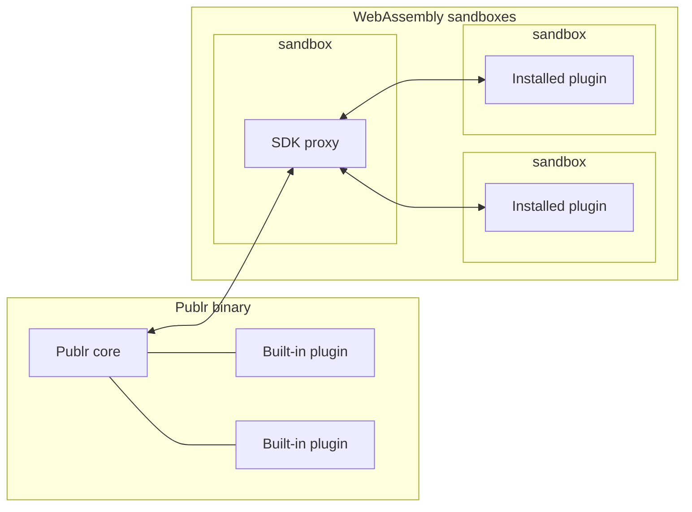
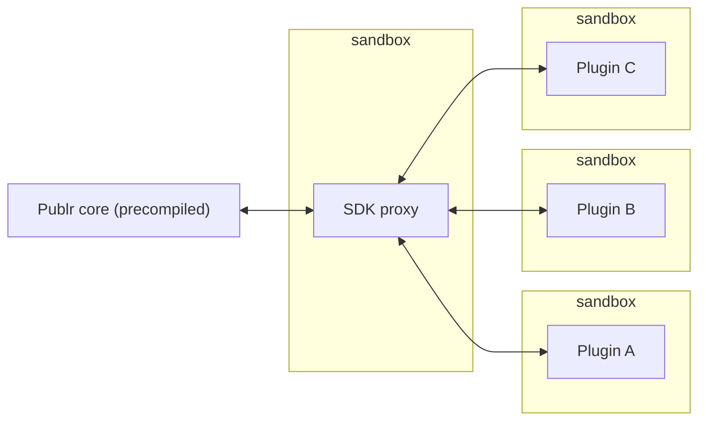

# Plugins

Plugins and apps follow [How to build well](agents.md#how-to-build-well).

Publr has two ways to run a plugin. Both use the same SDK. The difference is
where the plugin lives and who decides that it is there: every plugin is either
**built-in** (compiled into the binary, locked: it cannot be disabled) or **installed**
(loaded at runtime into the sandbox: enabled, disabled and removed from the admin). The same
source builds either way. In the code a plugin's mode is `native` or `sandboxed`, and what
its operations and hooks take (`*PluginCtx`) is `HostApi` for a native one (direct calls,
full access) or `SandboxApi` for a sandboxed one (every call a message to the host).



## Built-in plugins

A built-in plugin is placed into the Publr binary by a developer or a
build tool. The result is a tailored Publr: one binary with every battery
someone decided to put inside.

From the user's point of view these plugins are core features. They cannot
be disabled, removed or updated from the admin. Updating one means updating
the plugin source and building a new binary.

This is sometimes called **agency mode**: a software agency prepares the
build for a client, so what the client gets is stable, has every feature they
need, and just works. Only a competent operator decides what goes in, which
makes this setup very safe and resilient.

Two things follow from being inside the binary:

- **Full access.** A built-in plugin can reach the whole Publr API and any
  internals. Whoever builds the binary is responsible for checking it.
- **Deep integrations are possible.** Some plugins must be compiled in because
  they need things the SDK does not expose to the outside: swapping the
  database, adding database extensions, replacing the cache layer, and other
  advanced hooks.

A plugin that uses only the public SDK can be shipped both ways: compiled in,
or as an installed plugin. Whatever it does installed, it does the same compiled in, and
`zig build verify-full` proves it for every test plugin (see
[Build: Two-mode check](build.md#two-mode-check)).

## Installed plugins (DLP)

Installed plugins are the opposite. They are added from the admin, without
recompiling anything. Think of them as dynamically linked plugins, in the
spirit of DLLs, hence DLP.



Each installed plugin is a precompiled WebAssembly module running in its own
sandbox. It never touches Publr directly: every call goes through the SDK
proxy, which dispatches through the same operation pipeline everything else uses. That gives:

- **An enforced boundary.** The plugin can only do what the SDK exposes and
  what an administrator granted it.
- **Isolation.** A buggy plugin cannot crash Publr or read another plugin's
  memory. A call that loops or grows past its limits stops, and only that call fails.
- **No recompilation.** Install, update or remove a plugin from the admin or
  the CLI, and it just works. Publr stays one binary.

Installed plugins are managed under Settings > Plugins in the admin, and with `publr plugin`
([CLI](cli/plugin.md)). The Built-in tab lists the built-in plugins beside them, read
only: a build puts those there, and only a new build changes them. Added, an installed plugin
is listed and runs nothing; **enabling** it shows what it asks
for and starts it; disabling stops it and keeps what it was granted. What it does, it
does as itself: every call it makes is authorized as the plugin, with the permissions it
holds now. When it acts for someone (an editor calling its operation, a hook on their
save), each call gets the narrower of its permissions and that person's roles.

A newer module for a plugin already there does not replace it: it waits as the
plugin's next version. **Updating** shows what the new version asks for beside what the
plugin holds, then runs it; the version it replaces is kept, and **rolling back** returns
to it (and keeps the other in turn). A module that does not load in the sandbox is never
added.

### Permissions

A plugin asks for permissions by key, each with its own reason. The administrator sees
the sentence, the reason, the key and a tier before enabling it:

| Tier | On enabling | Examples |
|---|---|---|
| Low | granted | `content.read`, `schema.read`, `users.names`, a hook that sees an event |
| Medium | granted, listed | `content.write`, `content.drafts`, `release.manage`, a hook that changes an input |
| High | pending until approved | `users.read`, `users.write`, `content.purge`, `settings.global`, a raised limit |

Some operations no permission names, so no plugin ever reaches them: signing in and out,
passwords and set-password links, who may sign people in, setup, roles, saved views. A
plugin always reaches its own operations (`<name>.*`, `app.<name>.*`) and its own content
types' records without asking. Content permissions are held to its **content access**:
public types (the default), every type, or the ones the administrator ticks.

Anything granted can be revoked at any time, one at a time; the plugin's next call
answers `Denied` and it must carry on without. A key nothing installed provides is shown
as unavailable: the plugin runs without it.

### Limits

Every call into a plugin runs within limits: 100 ms of CPU (counted in instructions),
16 MiB of memory, 1,000 calls of its own, 1 MiB of output. A plugin that needs more asks
in its manifest, with a reason; each raised limit is a high-tier request.

## Writing an installed plugin

An installed plugin is written exactly like a built-in one, against the same SDK, with
`*PluginCtx` operations and hooks. On top, it declares what it asks for:

```zig
pub const permissions = [_]publr.plugin.Permission{
    .{ .key = "users.names", .reason = "Greets the people on the site by name" },
};
pub const limits: publr.plugin.Limits = .{ .cpu_ms = 2000, .reason = "Resizes images" };
pub const content_access: publr.plugin.ContentAccess = .{
    .recommend = .all,
    .note = "Indexes every type for search",
};
pub const depends_on = [_][]const u8{"newsletter@^1"};
```

Each hook carries its reason (`pub const reason = "..."`); an event hook names the event
it sees (`pub const event = "record.published"`), an operation or a notice, and sees only
that one, compiled in or installed. A plugin never writes `export fn`.

## One folder, and which are compiled in

Every plugin of a project is a folder under `plugins/`, `plugins/<name>/main.zig`, the
same source whichever way it runs. Which are compiled in is the project's decision, in
`publr.zon` beside that folder, and nothing else's:

```zig
.{
    .plugins = .{
        .native = .{ "blog", "hello" },   // compiled into publr: Built-in in the admin
    },
}
```

or every plugin under `plugins/`:

```zig
.{
    .plugins = .{
        .native = .all,
    },
}
```

With no `publr.zon`, or no `.plugins.native`, none is: every plugin is built for the sandbox and
installed at runtime. A plugin never says which it is: trusting code with everything is
its owner's choice, never its author's. `zig build` compiles in the ones listed (a name
`plugins/` lacks fails the build).

`publr plugin build --name <name>` builds `plugins/<name>/main.zig` for the sandbox with the
compiler Publr carries, so no Zig is needed: its manifest is read from the module itself and written into it, then it is added
and enabled (a new plugin) or applied as its next version (one already there, the previous
kept to roll back to). What it asks for is granted by tier; high requests wait for an
administrator. Built again unchanged, it is up to date. `zig build sandboxed-plugins` builds
every plugin under `plugins/` that is not compiled in with the same command into
`zig-out/sandboxed-plugins/<name>.wasm`, as the tests build theirs; see
[Build](build.md#the-plugins).

**Every plugin builds for the sandbox.** What cannot run there is left out of that build,
never a reason to refuse it: `schema_sql`, `bootstrap` and a sign-in provider (they need
the host), an operation or hook that takes the host's context (`*sdk.Ctx`) rather than
`*PluginCtx`, and, until the sandbox runs them, policies, pre hooks, field kinds,
statuses, transitions, filters and delivery gates. The build names each (`publr plugin
build` prints them; the manifest's `left_out` keeps them, and `plugin get` shows them;
the admin's plugin page does not yet).
Calling an operation left out answers `unavailable`; a hook left out never runs.

What a plugin calls is checked as it compiles: a `ctx.call` of an operation that none of
its declared permissions opens fails the build, naming the permission to add ("plugin
peek calls `user.list`, which needs `users.read`"). Its own namespace, the harmless
operations and record operations pass: a record operation may reach its own types, which
need nothing, and one that names another type without a permission is refused when it
runs, as `Denied`.

In the sandbox, operations, before, after, event and display hooks, content types, custom
fields and roles run; a role from a plugin grants only its own operations.

## Which one to pick

| | Built-in | Installed (DLP) |
|---|---|---|
| Added by | developer or build tool | admin, marketplace, repository |
| Needs a rebuild | yes | no |
| Access | full, trusted | SDK only, within its permissions |
| Isolation | none, it is part of the binary | sandboxed |
| Can be disabled or removed by the user | no | yes |
| Deep integrations (database, cache, ...) | yes | no |
| HTTP routes of its own | yes | not yet |
| Admin pages and a top bar item | yes | not yet |
| State, process hooks, operator commands | yes | not yet |
| Uses only the public SDK | works | works |

## Writing a built-in plugin

A plugin is one directory under `plugins/` with a `main.zig`, listed in `publr.zon`'s
`.plugins.native` to be compiled in. It imports one
thing, `publr`, and declares what it brings: a manifest (name, version,
summary), documented namespaces, operations exactly like the core's, each named
`<plugin>.<verb>` or `app.<plugin>.<verb>` (anything else fails the build; a plugin
cannot take a core namespace's name, or `app`), policies,
hooks, statuses, field kinds, content types, roles (see below), delivery gates (who
sees the apps, see [Apps](apps.md#delivery-gates)), filters (a `filters` array of
`model.filter.Definition`: a key, a label, operators, and how a clause constrains the
list; the admin's content list grows a pill for each) and a sign-in provider (see below). `zig build` finds it, compiles it in and
wires it up; nothing is registered anywhere else. Its operations appear in the
CLI and every other adapter, documented like the core's.

Storage is content types and snapshots. A plugin that needs to keep things
declares a type (`pub const content_types = [_]publr.plugin.ContentTypeDef{...}`,
usually private) and works with it through the record operations. The type is
created, or brought up to date, when the database opens, owned by the plugin:
it shows in the types manager as a system type, its declared fields are
locked, and editors can add fields of their own that survive the next
redeclaration. Its records get validation, permissions, listing, filtering
and the admin for free. History goes into
snapshots (`snapshot take/list/prune`, kinds of the plugin's own); parked
copies of a document go into slots (`record get --slot`), like the core's
`pending`. A plugin that truly needs its own table ships `schema_sql`; it runs only when
the plugin is compiled in.

A plugin can declare roles (`pub const roles = [_]publr.plugin.Role{...}`): a name, a
label and grants, each an operation or a namespace ending in `.*`. A name of its own is
a new role, such as the visitors of an app, granted `app.<feature>.*`; the name of one
there already adds grants to it, so a plugin whose operations editors should call
declares `editor` with `<feature>.*`. Only an admin gives an account a role; a plugin's
open sign-up creates accounts with its own. See [Auth](auth.md#roles).

A plugin can declare one **sign-in provider** (`pub const sign_in_provider:
publr.plugin.SignInProvider`): a name (`github`, in URLs and identity rows), a label
("Continue with GitHub"), its mark as one SVG path on a 24 by 24 canvas (brand marks are
the plugin's, never the icon set's), and three functions: `available`, whether its
credentials are in the environment (an unavailable provider is compiled in but not
offered); `authorize_url`, where to send the browser given the callback URL, the `state`
and the PKCE challenge the core made; and `identity`, which exchanges the callback's
code for who the person is (their stable id at the provider, their email and whether the
provider vouches for it, a name, an avatar). The core does the rest: the routes, the
cookie, the buttons, and whose account it is ([Auth](auth.md#signing-in-with-a-provider)).

A plugin can answer **HTTP routes** (`pub const routes = [_]publr.plugin.Route{...}`): a
method (`get` or `post`), a path and a handler, `fn (request, response, ctx)` like the
core's. Every path lives under a prefix the plugin owns, `/admin/<own>`, `/api/<own>` or
`/auth/<own>`, where `<own>` is its name or one of its namespaces; after the prefix a
segment may be a parameter (`/api/shop/orders/:id`). A plugin has at most 16. Its routes
come before the core's, and the server refuses to start when a prefix covers a core route
(a plugin named `content` would take `/admin/content`). A handler that calls operations
does it as whoever sent the request: `publr.plugin_routes.caller_context` gives the SDK
context, refusing a write that does not come from this site with the session's CSRF
token, as the REST API does. A route that signs someone in its own way (a token another
server made, say) gets a session from an operation and hands it to
`publr.plugin_routes.set_session`, which sets this site's session cookie as the core's
sign-in does. Routes run only compiled in; an installed build leaves them
out and says so.

A plugin can show in the **admin**. Its views are PTSX files in `ui/` beside its
`main.zig`, lowered with the admin's own when it is compiled in: they import the design
system as `@publr/ui/<Name>.ptsx` and the admin's views as `@publr/admin/<Name>.ptsx`, and
are rendered as `publr.admin.views.<Name>`. A view's name may not be one the admin or the
design system has, so name it after the plugin. An icon it names only at runtime goes in
its `ui/icons.txt`, one per line, as the admin's do.

A plugin's page is drawn like the core's: its view returns one of the admin's layouts,
`IndexPage` (a list), `FormPage` (one thing), `HubPage`, `CardPage` or `ListDetailPage`
(working through a set of things one at a time, as a merge does), and fills its slots
(title, parents for the crumbs, description, actions, meta, tabs, notice, filters, the
list, empty, footer; for a form the column, the aside and the danger zone, where
`ConfirmAction` asks before anything is undone). Two versions of something compare on
`CompareSides` and `CompareField`, their values shaped by `publr.admin.compare` (see
`admin.md`). The layout draws the chrome, the
sidebar, the crumbs and every gutter; the view sets no spacing of its own, and the build
refuses a page drawn otherwise. Who is signed in and the CSRF token are read where they
are needed as `Publr.request.session` (`name`, `email`, `csrf`); no view forwards them.

```tsx
import { IndexPage } from "@publr/admin/IndexPage.ptsx";

export function GuestbookEntries({ entries }: GuestbookEntriesProps) {
  return (
    <IndexPage
      title="Guestbook"
      description="What visitors wrote, newest first."
      empty={entries.length === 0 && <Empty>…</Empty>}
    >
      <Table>…</Table>
    </IndexPage>
  );
}
```

The route's handler renders it with `publr.admin.screen(&session, .ok, View, props)`,
the view's own data only, after `publr.admin.require` for the signed-in session.

- A settings page (`pub const settings_pages = [_]publr.plugin.SettingsPage{...}`): a
  label, an icon and the path of one of its own `get` routes, listed in the Settings
  sidebar for whoever may call the operation it names, and lit on that path and every
  path under it. A page that belongs under another's entry says so with
  `publr.admin.screen_with(&session, .{ .settings_path = "/admin/<other>" }, ...)`.
- A top bar item (`pub fn top_bar(session: *const publr.admin.Session)
  publr.admin.Error!?publr.admin.render.Node`): called for every signed-in page; null
  shows nothing. An item that fails is left out and logged.
- A segment joined to the app picker (`pub fn app_picker_segment(session: *const
  publr.admin.Session, attached: bool) publr.admin.Error!?publr.admin.render.Node`): drawn
  after the picker as one control where the project has apps (`attached` true: draw it as
  the control's end, `StatusButton attach="end"`), on its own in the top bar where it has
  none. Null shows nothing.
- Where someone who must sign in goes (`pub fn sign_in_at(session: *const
  publr.admin.Session) anyerror!?[]const u8`): asked on the login page before the form and
  before a trusted issuer; the first plugin that names an address sends the browser there.
  Null leaves the login as it is. The page they asked for is the login's `return`
  (`publr.admin.query_param(session, "return")`), a path on the site; carry it on with
  `publr.admin.query_value` so they land there once signed in.
- Actions on the rows of another plugin's page (`pub const row_actions =
  [_]publr.plugin.RowAction{...}`): the page's slot as its owner names it, a label, a path
  where `{name}` stands for the row's name, a row kind (every row when empty) and the
  operation whoever sees it may call. The page's owner reads them for each row with
  `publr.admin.row_actions(session, slot, kind, name)`; neither plugin knows the other's
  code.

A plugin can **keep state** for as long as the process runs: one `pub const State =
struct {...}`, made when the server opens the project (with `pub fn init(state: *State,
process: publr.plugin.Process) !void` when its fields need more than defaults; `deinit`
if it holds something to free) and never in a top-level `var`. An operation, a route or a
hook reaches it with `publr.plugin_states.of(ctx, @This())` from a context, or
`publr.plugin_states.from(project.plugin_states.?, @This())` from the project.

A plugin can also act on the process around the operations:

- `pub fn before_command(command: *publr.plugin_hooks.Command) !void` runs before any
  command, in name order: it may move the process into another folder
  (`std.process.setCurrentDir`) and take its own arguments off `command.args`, or change
  `command.db_path`. What is left runs as the command.
- `pub fn serving(serve: publr.plugin_hooks.Serving) !void` runs once `serve` listens, with
  the project and the port it got, before the first request. It may name the session
  cookie (`serve.project.session_cookie`), so two servers on one host keep their sign-ins
  apart. One that fails stops `serve`.
- `pub const operator_commands = [_]publr.plugin.OperatorCommand{...}`: a name and a
  handler, answered at `POST /_publr/<plugin>/<name>` only with the running server's
  operator key, which only processes of the same user on the machine can read
  (`<db>.serve`). `publr.operator.find` and `publr.operator.post` send one.

A plugin can **build on another**. It names what it depends on, each another plugin and,
after `@`, the versions it works with (exact, `1.2.3`, or caret, `^0.2`: the same leftmost
non-zero part, no older): `pub const depends_on = [_][]const u8{"newsletter@^1.2"}`.
A compiled-in plugin's requirements are checked when the binary is built (present, in
range, never round a loop); an installed one's when it is enabled. A plugin it only works
with when present goes in `compatible_with`, with the same ranges.

A plugin never imports another. It declares, in its own words, each operation of another
plugin it uses: the name, what it sends and the part of the answer it reads, listed in
`remotes`:

```zig
pub const remotes = [_]type{Subscribe};
pub const Subscribe = publr.plugin.Remote(
    "newsletter.subscribe",
    struct { email: []const u8 },
    struct { subscribed: bool },
);
// ctx.call(Subscribe, .{ .email = email }), or a hook on `Subscribe.name`
```

Every plugin's manifest carries the shapes of its own operations and the remote ones it
uses. When both plugins are compiled in, a remote shape that does not fit the real one is
a compile error naming the field. A plugin's own `interface.zig`, beside its `main.zig`,
is for its own files: `@import("newsletter")` inside newsletter.

A plugin can run once the database opens (`pub fn bootstrap(ctx: *sdk.Ctx) sdk.Error!void`),
as the system, after every declared type and field is in place: a setting the product
needs, a record that must exist. It runs at every start, so it checks before it writes.

What a plugin keeps for itself and nobody edits (carts, reservations, stock movements,
logs) is not content: it declares each kind as an internal record collection,
`pub const internal_records = [_]publr.plugin.InternalCollection{ .{ .kind = "movement",
.indexed = &.{"stock"}, .append_only = true } }`, and reaches them through the `internal`
operations (see [the CLI page](cli/internal.md)): its own records only, in the request's
app, with no permission to ask for. They never appear in the admin's content list.

A plugin can also keep values on the accounts themselves: `custom_fields` declares
custom field groups the way `content_types` declares types, each with its location
(`destination` user or media). They are created or brought up to date when the database
opens, their fields locked; a template reads the signed-in user's with
`Publr.request.userField('<group>.<field>')`.

The contract is checked when the binary compiles: a missing manifest, a bad
name, an undocumented operation, a hook on an operation that does not exist,
two plugins with the same name, all stop the build with a message naming the
plugin. Plugins are applied in name order, always. Tests live next to the code
and run with `zig build test`. The `plugins/` directory and `publr.zon` are yours:
Publr's own repository does not track them, so a fork can commit its plugins alongside
the core. `-Dplugins=<dir>` builds from another folder instead, with the `publr.zon`
beside it; a link in it counts, so one folder can gather plugins kept elsewhere.
