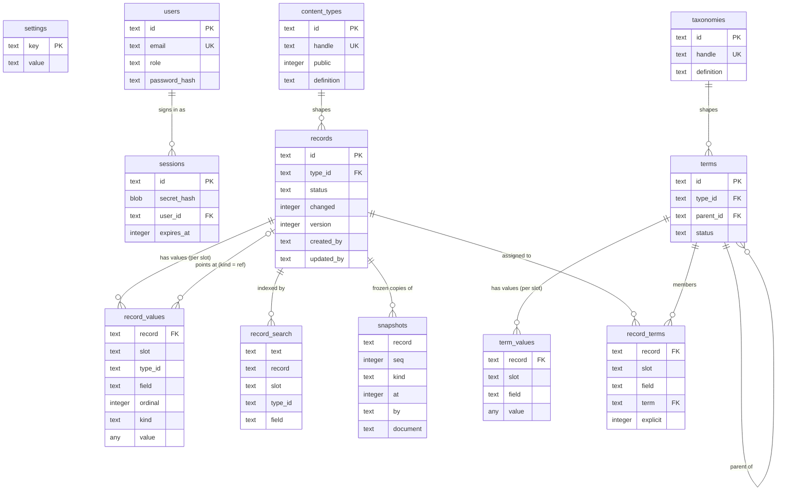

# Database schema

Publr keeps everything in one SQLite file (`data/publr.db` by default), in
strict tables created by `src/lib/db/schema.sql` when the database opens. There
are no migrations: pre-release, the schema is the schema. Ids are 24 hex
characters, times are Unix milliseconds, booleans are `0`/`1`. A record's, term's, user's,
internal record's or saved view's id is time-ordered: the millisecond it was made (12
characters), a counter within that millisecond (4), random (8). Sorted by id, rows are in
the order they were made; copies of a database merged later cannot collide.

The shape is deliberately small. Two tables carry the content of the whole
site, whatever a plugin adds: `records` (one row per thing: a record, an
author, later a media item) and `record_values` (one row per field value, in
a named *slot*: `live`, `pending`, or a plugin's own copy). A content type
says which fields a record has; the type is data (`content_types`), plugins
declare their own types in code and they are created when the database
opens. Plugins therefore extend storage by adding **types and fields, not
tables**. History is the other storage shape: `snapshots`, frozen read-only
copies of documents (revisions and whatever else a plugin archives). The rest
is authentication (`users`, `sessions`), site settings (`settings`), and the
full-text index (`record_search`).

Classification is the same shape once more, on its own tables: `taxonomies`
are the schemas of terms as `content_types` are of records, `terms` hold the
identity and lifecycle of a term (plus its parent), `term_values` its field
values per slot, `term_search` its full-text index. One store implementation
serves both domains; only the table names differ. `record_terms` joins the
two: every term a record is assigned to, in a slot, with its ancestors.

`settings` stands alone: a key/value table the core and plugins read one row
at a time; it is not a record.

## `settings`

Site-wide key/value settings, one row per setting, written by the core
(`site.init` records `site.initialised_at`), later by the settings operations
and by plugins under their own dotted prefix (`seo.default_image`).

| Column | Type | Meaning |
|---|---|---|
| `key` | text, primary key | Setting name, dotted (`site.initialised_at`) |
| `value` | text | The value as text |
| `updated_at` | integer | Last write |

## `users`

Accounts. What an account may do is its roles (`user_roles`). An account
without a password hash and without an identity (`identities`) is inactive: it
was created with a set-password link and cannot sign in until the link is
redeemed.

| Column | Type | Meaning |
|---|---|---|
| `id` | text, primary key | Account id |
| `email` | text, unique | Sign-in email, lowercased and trimmed |
| `display_name` | text | Name shown in the admin |
| `password_hash` | text, nullable | Argon2id PHC string; null while inactive, or when a provider is the only way in |
| `password_token_hash` | blob, nullable | SHA-256 of the current set-password token |
| `password_token_expires_at` | integer, nullable | When that token stops working |
| `created_at`, `updated_at` | integer | Timestamps |

## `user_roles`

The roles an account holds, one row each, at most 16 per account. A role is
data declared in code (core's `admin` and `editor`, and each plugin's), not a
row: a name no built-in plugin declares any more grants nothing. Deleting a
user removes their rows.

| Column | Type | Meaning |
|---|---|---|
| `user_id` | text, references `users` | Whose role; cascades on delete |
| `role` | text | The role's name |

Primary key `(user_id, role)`. Index `user_roles_role (role, user_id)`: how
many accounts hold `admin` (the last one stays).

## `sessions`

Signed-in sessions. The client holds `id.secret`; only the hash of the
secret is stored. Rows slide (expiry extends on use) and are removed by
sign-out, expiry cleanup, or the per-user cap (32 newest kept). Deleting a
user removes their sessions.

| Column | Type | Meaning |
|---|---|---|
| `id` | text, primary key | Session id (the public half of the token) |
| `secret_hash` | blob | SHA-256 of the secret half |
| `user_id` | text, references `users` | Whose session; cascades on delete |
| `expires_at` | integer | Absolute expiry |
| `created_at` | integer | When it was created |

Indexes: `sessions_user_id (user_id)`, `sessions_expires_at (expires_at)`.

## `views`

A user's saved views of the content list: a name over a set of filters, kept
as the JSON `view create` takes (`{"types":["post"],"status":"draft",
"created_by":"me"}`), `me` and relative days resolved when the list is drawn.
Private: listed, read and changed by the owner alone. Deleting a user removes
their views. Up to 64 per user.

| Column | Type | Meaning |
|---|---|---|
| `id` | text, primary key | View id |
| `user_id` | text, references `users` | Whose view; cascades on delete |
| `name` | text | The name the sidebar shows, up to 80 characters |
| `query` | text | The filters, as JSON |
| `created_at`, `updated_at` | integer | Timestamps |

Indexes: `views_user (user_id, name)`.

## `internal_records`

What a plugin keeps for itself and nobody edits (carts, reservations, stock movements,
logs), one JSON document per row, in collections the plugin declares
(`internal_records`). Never content: no statuses, drafts, revisions or search. Every read
and write is held to one plugin, one app and one collection: from a plugin's code, its own
and the request's app; with no plugin running, an administrator names them. Up to 64 KiB
per document.

| Column | Type | Meaning |
|---|---|---|
| `id` | text, primary key | Record id |
| `plugin` | text | Whose: the plugin that keeps it |
| `app` | text | The app it belongs to (`app.zon`'s `.name`); empty for the project's own |
| `kind` | text | The collection, as the plugin declares it |
| `document` | text | The record, a JSON object |
| `version` | integer | Bumped on every write; `expected_version` refuses a stale one |
| `created_at`, `updated_at` | integer | Timestamps |

Indexes: `internal_records_scope (plugin, app, kind, created_at)`: a collection's records,
newest first.

## `internal_record_values`

The fields an internal record is found by: each field its collection declares as indexed
that the record holds as text, an integer or a flag, kept as text (`42`, `true`). Written
with the record; deleting the record deletes them.

| Column | Type | Meaning |
|---|---|---|
| `record` | text, references `internal_records` | The record; cascades on delete |
| `field` | text | The indexed field |
| `value` | text | Its value, as text |

Primary key `(record, field)`. Indexes: `internal_record_values_lookup (field, value,
record)`: the records whose field holds a value.

## `sign_on_tokens`

Sign-on tokens already redeemed (`sign_on.redeem`), so each works once. A row
lives until the token's own expiry; after that the token is refused by its date
and the row is removed.

| Column | Type | Meaning |
|---|---|---|
| `id` | text, primary key | The token's `jti`, as the issuer set it |
| `expires_at` | integer | The token's expiry, Unix milliseconds |

## `devices`

Devices a person let act for their account: an agent, a CLI on another machine. The
device holds `id.secret`; only the hash of the secret is stored. A device never expires;
revoking it keeps the row, so the activity log (`token:<id>`) can still name it. Deleting
the user removes their devices.

| Column | Type | Meaning |
|---|---|---|
| `id` | text, primary key | Device id (the public half of the token) |
| `secret_hash` | blob | SHA-256 of the secret half |
| `user_id` | text, references `users` | Whose account it acts for; cascades on delete |
| `name` | text | What the person approved it as ("An agent on Ada's laptop") |
| `scope` | text | `read`, `drafts` or `write` |
| `created_at` | integer | When it was approved |
| `last_used_at` | integer | When it last made a request, to the minute |
| `revoked_at` | integer, null | When it was revoked; null while it works |

Index: `devices_user_id (user_id, created_at)`.

## `device_requests`

Devices waiting for a person to approve them (`device.start`), until they collect their
token (`device.poll`) or ten minutes pass. The device holds the device code; only its hash
is stored. The person types the user code.

| Column | Type | Meaning |
|---|---|---|
| `code_hash` | blob, primary key | SHA-256 of the device code |
| `user_code` | text, unique | `WXYZ-1234`, what the person types or follows |
| `name` | text | The name the device asked for |
| `scope` | text | The scope asked for, then the one approved |
| `state` | text | `pending`, `approved` or `denied` |
| `user_id` | text, references `users`, null | Who approved or denied it |
| `expires_at` | integer | When the request lapses, Unix milliseconds |
| `created_at` | integer | When the device asked |

Index: `device_requests_expires_at (expires_at)`.

## `identities`

Who a sign-in provider says an account is (`identity.sign_in`, `identity.link`).
An account may hold up to 16, a provider's user belongs to one account. Deleting
a user removes their rows. The account is keyed on the provider and its id,
never on the email, which is only what the provider last said.

| Column | Type | Meaning |
|---|---|---|
| `provider` | text | The provider's name, as its plugin declares it (`github`) |
| `provider_id` | text | The provider's stable id for the person |
| `user_id` | text, references `users` | Whose identity; cascades on delete |
| `email` | text, nullable | The email the provider last reported |
| `created_at` | integer | When it was linked |
| `last_used_at` | integer | The last sign-in through it |

Primary key `(provider, provider_id)`; index `identities_user_id` on `user_id`.

## `sandboxed_plugins`

The installed plugins added to the project, one row each: whether it runs, what the
administrator granted and denied, which content it may reach, a newer version waiting to
be applied, and the version the last update replaced, kept to roll back to. Each module
is a file on the data drive named by its hash (`plugins/<hash>.wasm` beside the
database), swept once no row names it; the manifests are kept here as the modules
carried them, so listing plugins never reads a module. Reloading, updating or waking a
project reads this table again. See [Plugins](plugins.md#installed-plugins-dlp).

| Column | Type | Meaning |
|---|---|---|
| `name` | text, primary key | The plugin's name, from its manifest |
| `version`, `hash`, `manifest` | text | The current version: its version, the SHA-256 of its module, its manifest as JSON |
| `enabled` | integer | 1 while it runs; 0 when added and not yet enabled, or disabled |
| `granted` | text | The permission keys granted, as a JSON array; kept while it is disabled |
| `denied` | text | The keys an administrator refused, as a JSON array |
| `content_access` | text | `{"scope":"public"}`, `{"scope":"all"}` or `{"scope":"specific","types":[...]}` |
| `next_version`, `next_hash`, `next_manifest` | text, nullable | A newer module uploaded for it, waiting to be applied |
| `previous_version`, `previous_hash`, `previous_manifest` | text, nullable | The version the last update replaced |
| `installed_at`, `updated_at` | integer | Timestamps |

## `content_types`

Content types are data: the schemas of records. The full definition (kind and
fields included) is stored as JSON in `definition`; a few properties are also
columns for listing. A type's id is derived from its handle (SHA-256, first 24
hex characters), so a type declared in code has the same id in every database.
Types created through `content_type create` and types declared by plugins
(`pub const content_types` in the plugin, applied by `SDK.bootstrap` when the
database opens) live side by side in this table.

| Column | Type | Meaning |
|---|---|---|
| `id` | text, primary key | Type id, from the handle |
| `handle` | text, unique | Machine name (`post`) |
| `name` | text | Display name |
| `icon` | text | Icon name for the admin |
| `public` | integer | `1` if anonymous callers may read its live records |
| `system` | integer | `1` when a plugin owns the type (`owner` in the definition names it): its declared fields are locked, fields added by hand on top are kept across redeclarations |
| `editor` | text | Editor to use (`form` by default) |
| `editor_config` | text | Editor configuration as JSON |
| `definition` | text | The complete definition as JSON (source of truth) |
| `created_at`, `updated_at` | integer | Timestamps |

## `records`

One row per record: identity, status and the columns every list needs. A
record's field values live in `record_values`, not here; the title shown in
lists is the value of the type's `title_field`, joined in. `version` grows on
every write and status change and is the optimistic-concurrency token.
Deleting a type deletes its records; deleting a record deletes its values.

Two axes: `status` is publication (`draft`, `published`, `archived`,
`deleted`; moved by transitions), `changed` is editing: `1` while a live
record has edits parked in its `pending` slot, whatever the status. Unpublish,
archive and delete leave `changed` and the pending copy alone.

| Column | Type | Meaning |
|---|---|---|
| `id` | text, primary key | Record id |
| `type_id` | text, references `content_types` | Its type; cascades on delete |
| `status` | text | A status id from the registry (`draft`, `published`, ...) |
| `changed` | integer | `1` when a pending copy holds unpublished edits |
| `version` | integer | Version, starts at 1 |
| `created_at`, `updated_at` | integer | Timestamps |
| `created_by` | text, nullable | The user who created it (a fact, not a byline) |
| `updated_by` | text, nullable | The user of the last save or transition |
| `app` | text, nullable | The app it belongs to, by the `.name` in its `app.zon`; null for the project's own. Where the admin shows it, never who may read it; not a version change |

Indexes: `records_list (type_id, status, updated_at)`; `records_changed
(type_id, updated_at) WHERE changed = 1`; `records_app (app, updated_at)`.

## `record_values`

Every field value of every record, one row per value, under a slot. There is
no JSON document in the database; reads assemble one from these rows, and
every scalar field of the live slot is filterable and sortable through the
index.

A slot is a named copy of the document. The core uses `live` (what everyone
reads) and `pending` (edits parked on a live record, promoted to `live` by
`record publish`, dropped by `record discard_changes`); a plugin may keep its
own (`release:<id>`) and promote it the same way. Only `live` is indexed:
filters, sorting, slug uniqueness, referrers and delivery search never see
other slots; `record get --slot` reads one explicitly (previews).

| Column | Type | Meaning |
|---|---|---|
| `record` | text, references `records` | The record; cascades on delete |
| `slot` | text | Which copy: `live`, `pending`, or a plugin's own |
| `type_id` | text | The record's type (a copy of `records.type_id`, so filters hit the index without a join) |
| `field` | text | Dotted path to the leaf field (`title`, `seo.description`, `faq.question`) |
| `ordinal` | integer | Position inside the nearest repeated ancestor (many reference, repeater item); `0` otherwise |
| `kind` | text | Storage kind, from the field kind: `int` (integer, datetime ms, boolean `0`/`1`), `real` (number), `text` (string, slug, email, url, select), `ref` (reference and image target ids), `long` (text, richtext) |
| `value` | any | The value in the storage class its kind requires (a `CHECK` enforces it) |

Primary key `(record, slot, field, ordinal)`. Indexes: `record_values_lookup
(type_id, field, value, record) WHERE slot = 'live' AND kind <> 'long'` makes
every scalar field filterable and sortable and answers uniqueness probes
(slugs); `record_values_referrers (value) WHERE slot = 'live' AND kind = 'ref'`
answers "who points at this id" (`record referrers`). Long text is stored in the same table but kept
out of both indexes. Uniqueness within a type (a slug) is checked by the
write inside its transaction through the lookup index.

## `record_search`

FTS5 index over the values of fields marked `searchable`, one row per value,
rebuilt for a record on every save; `record list --search` joins it.

| Column | Meaning |
|---|---|
| `text` | The indexed text |
| `record`, `slot`, `type_id`, `field` | Unindexed identifiers; delivery search matches `slot = 'live'` |

## `snapshots`

Frozen, read-only copies of a record's document, numbered per record. The
other storage shape: records are queryable content, snapshots are a sealed
archive, so the document is stored whole as JSON here (never queried by
field, never edited, may number in the millions: one row each, no index load
on content). The core takes one of kind `revision` whenever a live document
is replaced (a draft save, a publish of pending edits); plugins take their
own kinds (`snapshot take`). Restore is a normal `record save` of the stored
document. `snapshot prune` keeps the newest N of a kind; purging a record
removes its snapshots.

| Column | Type | Meaning |
|---|---|---|
| `record` | text | The record it is a copy of |
| `seq` | integer | Sequence within the record, from 1 |
| `kind` | text | Why it exists: `revision`, or a plugin's name for it |
| `at` | integer | When it was taken |
| `by` | text, nullable | The acting user |
| `document` | text | The frozen document as JSON |

Primary key `(record, seq)`; index `snapshots_kind (record, kind, seq)`.

## `activity`

What was done: one row per top-level write that completed, appended in the write's own
transaction (a rolled-back write leaves none). The calls it set off inside are listed in
it, not rows of their own. Append-only: triggers refuse every `UPDATE` and `DELETE`, so a
rollback, revert or merge in Cloud is a row of its own, never a change to these. Kept
forever; no index beyond the id, which is the order things happened. Inputs are stored
with secrets masked (`model/secret.zig`). Read with `activity list`.

| Column | Type | Meaning |
|---|---|---|
| `id` | integer | Increasing: the order things happened |
| `at` | integer | When, milliseconds |
| `actor` | text | A user id, `system`, `anonymous`, `plugin:<name>`, `token:<id>` |
| `app` | text | The app it came through, empty for none |
| `operation` | text | `plugin.disable`, `record.save` |
| `input` | text | The input as JSON, secrets replaced by `•` |
| `units` | text | JSON array of what it changed: `record:<id>`, `plugin:<name>` |
| `calls` | text | JSON array of the operations it set off inside, in order |

Triggers `activity_kept`, `activity_never_removed`.

## `errors`

What was refused or failed: one row per top-level call that was denied, given invalid
input, refused (a dependency, a contract) or failed, reads included. Written after the
call's rollback, in a transaction of its own. Append-only and kept forever like
`activity`. Read with `errors list`.

| Column | Type | Meaning |
|---|---|---|
| `id` | integer | Increasing: the order things happened |
| `at` | integer | When, milliseconds |
| `actor` | text | Who called, as in `activity` |
| `app` | text | The app it came through, empty for none |
| `operation` | text | The top-level operation |
| `input` | text | The input as JSON, secrets replaced by `•` |
| `calls` | text | JSON array of the operations it set off inside before failing |
| `error` | text | The error's name: `Denied`, `Invalid`, `Failed` |
| `message` | text | What went wrong, in words, when there is a message |
| `failed_in` | text | The inner operation the failure came from; empty when its own |

Triggers `errors_kept`, `errors_never_removed`.

## `taxonomies`

The schemas of terms, exactly as `content_types` are the schemas of records:
same columns, same JSON definition (a content type definition with
`hierarchical` set when terms may have a parent), same derived id. A
taxonomy is enabled on a content type by giving the type a field of kind
`terms` that names the taxonomy; see [Content](content.md).

| Column | Type | Meaning |
|---|---|---|
| `id` | text, primary key | Taxonomy id, from the handle |
| `handle` | text, unique | Machine name (`topics`) |
| `name` | text | Display name |
| `icon` | text | Icon name for the admin |
| `public` | integer | `1` if anonymous callers may read its live terms |
| `system` | integer | `1` when a plugin owns the taxonomy |
| `editor` | text | Editor to use (`form` by default) |
| `editor_config` | text | Editor configuration as JSON |
| `definition` | text | The complete definition as JSON (source of truth) |
| `created_at`, `updated_at` | integer | Timestamps |

## `terms`

One row per term: `records` for the term domain, with one column more, the
parent. A term belongs to exactly one taxonomy; its title and slug are field
values in `term_values`, joined in by the lists. The same lifecycle as a
record: status, pending edits (`changed`), version, revisions in `snapshots`
(ids are unique across both domains, so they share the snapshot table).

| Column | Type | Meaning |
|---|---|---|
| `id` | text, primary key | Term id |
| `type_id` | text, references `taxonomies` | Its taxonomy; cascades on delete |
| `parent_id` | text, nullable, references `terms` | The parent term in the same taxonomy (hierarchical taxonomies); a term with children cannot be purged |
| `status` | text | A status id from the registry |
| `changed` | integer | `1` when a pending copy holds unpublished edits |
| `version` | integer | Version, starts at 1 |
| `created_at`, `updated_at` | integer | Timestamps |
| `created_by`, `updated_by` | text, nullable | The acting users |
| `app` | text, nullable | The app it belongs to, as on `records` |

Indexes: `terms_list (type_id, status, updated_at)`; `terms_changed (type_id,
updated_at) WHERE changed = 1`; `terms_parent (parent_id)`.

## `term_values`

`record_values` for terms: the same columns, indexes and slot rules, over
`terms`. The `record` column holds the term id and `type_id` the taxonomy
id; the names are those of the shared store.

## `term_search`

`record_search` for terms: the FTS5 index over searchable term values.

## `user_values`

`record_values` for users: the same columns, indexes and slot rules, over
`users`. Every account has at most one document, in the `live` slot under the
type id `user`, holding the values of its custom fields; each custom field
group that applies to the account is one top-level group in that document,
so a field's path is `<group handle>.<field name>` (`basic.bio`). Deleting
the account cascades to its rows.

## `user_search`

`record_search` for users: the FTS5 index over searchable user values.

## `record_terms`

Which terms a record is assigned to, per slot and per `terms` field. The
editor's explicit selections are also stored as `ref` values in
`record_values` (so a document assembles and referrers resolve as for any
reference); this table is the membership index the lists filter on. It holds
every selected term **and every ancestor** of it, up to the root: a record
assigned to `A > B > C` is a member of A, B and C, so filtering by A finds
it. `explicit` marks the terms the editor chose; the rest are there because a
descendant was. Rows are rewritten with the values on every save, promoted
with the slot on publish, and rebuilt for the affected records when a term
is moved under another parent.

| Column | Type | Meaning |
|---|---|---|
| `record` | text, references `records` | The record; cascades on delete |
| `slot` | text | Which copy: `live`, `pending`, or a plugin's own |
| `field` | text | The `terms` field of the record's type |
| `term` | text, references `terms` | The term; cascades on delete |
| `ordinal` | integer | Position among the explicit selections; `0` for an ancestor |
| `explicit` | integer | `1` when selected, `0` when included as an ancestor |

Primary key `(record, slot, field, term)`; index `record_terms_reverse (term,
slot, record)` answers "which records are in this term".

## `media`

The facts of each file in the media library, one row per record of the `media`
type: what only the library writes. What people write about a file (title, alt
text, caption, credit, focal point) is the record's document, and its folder and
tags are its `media_folders` and `media_tags` terms. The bytes are kept outside
the database under `storage_key`.

| Column | Type | Meaning |
|---|---|---|
| `record` | text, references `records` | The file's record; cascades on delete |
| `filename` | text | The name it was uploaded with, or had in the media folder |
| `mime_type` | text | What it is, decided by its extension and checked against its bytes |
| `size` | integer | Bytes |
| `width`, `height` | integer, nullable | Pixels, for images stb reads |
| `storage_key` | text, unique | Where the bytes are: `YYYY/MM/<stem>-<random>.<ext>`, or the path a file put into the media folder by hand already had |
| `hash` | text | SHA-256 of the bytes, hex |
| `private` | integer | `1`: served only to signed-in users, never cached by others |
| `created_at` | integer | Upload time, ms |
| `unreviewed` | integer | `1`: taken in from the media folder by `media sync`; `0` once someone changes the file |
| `missing` | integer | `1`: the last `media sync` found its bytes gone from the media folder |

Index `media_created (created_at, record)` serves the newest-first list;
`media_hash (hash)` finds an upload of the same bytes.

## `deps_edges`, `deps_artifacts`, `deps_pending`, `deps_meta`

The dependency index, owned by the `publr_deps` library and created by it in
the same database (`Server.init` opens it), shared by every app. `deps_edges (artifact,
key)` is what
every built page or fragment read; `deps_artifacts (artifact, hash)` the hash
of its last bytes, so an unchanged rebuild writes nothing; `deps_pending
(key, batch)` the changed keys waiting to be planned, `batch` 0 while
collecting; `deps_meta (name, value)` the batch counter and the time of the
last change. Keys are `record:<id>`, `type:<handle>`, `records`,
`template:<app>/<path>` and `asset:<app>`; artifacts are an app and a URL inside it
(`www:/posts/hello`, `www:/_islands/latest-posts`). See [Apps](apps.md).

## Coming with later gates

API token tables come with the tokens gate. A built-in plugin that truly needs its own table names it
`<plugin>_<table>` and creates it from `schema_sql` when the database opens;
the default, for every plugin, is a declared content type.

Custom-field schemas use `field_groups` with scope `custom_fields` and the group handle as owner.
Each stores its name, fields and location rules with a private component shape. No corresponding `content_types` or `records` rows are created. Settings
sections continue to use `content_types.kind = settings` and their existing singleton records.

The built-in Website definition (`handle = website`, `kind = settings`, owner `publr`) stores the
homepage's fields in the singleton's `record_values`, using the normal live/pending slots. Site
rendering depends on `type:website`, so publishing settings uses normal record invalidation.

## `field_groups`

The shared field schema for a content type, taxonomy, settings section, component,
user or media destination. `scope` names the owner domain and `owner` identifies it;
together they form the primary key. `definition` stores the fields and group options
as JSON. Document values stay with their owning entity.

Schema writes update the owner and its field group in one transaction. A one-time transaction
on database open moves existing inline fields and legacy custom-field settings into this table;
record values and owner IDs are preserved. The API still returns a complete definition with fields.
