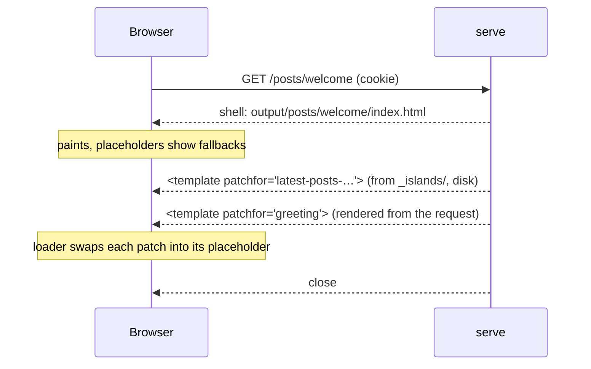

# Streaming islands

A design for delivering islands in the page's own response, with no second
round trip, and for running that delivery on Publr's servers or on someone
else's. Status: proposal. Nothing here is built yet. How islands work today
is in [Apps](apps.md); what a publish rebuilds is there too.

## The problem

A static page is a file. `serve` hands the file to the socket untouched, so
the server never reads the request, and every island is assembled by the
browser afterwards:

| Today | first paint | the island | round trips after the HTML |
|---|---|---|---|
| static island | fallback, or a `prerender` | fetched (preloaded from `<head>`), kept 60 s | 1, mostly hidden by the preload |
| dynamic island | fallback, or a build-time `prerender` as a visitor nobody knows | fetched with credentials after load | 1, on the critical path |
| dynamic island on a dynamic page | the real thing | rendered into the response | 0, but the page is no longer a file |

The only way to get a cookie-dependent fragment into the first response today
is to make the whole page dynamic, which gives up the static build for that
route. That is the same trade Next.js asks for when a page reads the request,
and the same one Partial Prerendering was invented to avoid: a prerendered
shell sent at once, holes filled by chunks streamed into the same response.

Publr is a better fit for that model than React is. The shell is already a
file, every dynamic fragment is already an independent render keyed by a
`<template patchfor="<key>">`, and the loader already applies batches of
patches by key. What is missing is a serve path that writes the two together.

## The streamed response

For a route whose page has islands, `serve` writes one response in two
stages on the same connection:

1. **The shell.** The static file's bytes, placeholders in place, written at
   once. Time to first byte is the same as serving the file.
2. **The patches.** With the connection held open, one `<template
   patchfor="<key>">…</template>` per island, appended to the end of the
   body, then the close. A static island's patch is its file under
   `_islands/`, spliced from disk. A dynamic island's patch is rendered from
   the request, session and all, the way `/_islands/<key>` renders it today.
   Nested dynamic islands flatten into their parent's patch, as a per-request
   render does now.



The browser paints the shell as soon as the first chunk arrives and swaps
each fragment in as its chunk lands. No fetch, no waiting for the loader
script before the fetch can start.

### The loader

One addition: besides fetching a placeholder's `src`, the loader watches the
document for inline `template[patchfor]` elements (a `MutationObserver` on
`body` until the document has finished loading) and applies them by key.
A placeholder whose patch arrives inline never fetches. A placeholder whose
patch has not arrived by document end fetches as it does today, so a page
served from a plain file host, or a page whose stream was cut, still
completes. The same `output/` works in both modes without a rebuild.

### Headers

A response that carries a per-request patch is `no-store`, as a dynamic
fragment is today. The route keeps its fast shell but stops being a cached
page: back and forward refetch it. A page with no dynamic islands, and no
static islands opted into splicing, is served exactly as now, a file with
its `ETag` and `max-age=60`. `X-Publr-Served` gains a `stream` value beside
`file`, `memory` and `render`.

### What cannot change after the shell

Anything in `<head>`. An island cannot add a title, a preload or a stylesheet
once the shell is out. The `prerender` fallback has the same limit today, so
nothing is lost, but it is the reason a fragment's styles must already be in
the page's inline stylesheet, which the build guarantees.

### Static islands are the smaller win

Splicing a static island from disk saves a fetch that the `<head>` preload
already mostly hides. The alternative of simply embedding the component and
letting the dependency index rebuild the pages that read it is cheap too.
The island form earns its place on shared fragments: one file rebuilt
instead of every page that names it, and one fragment cached by the browser
across pages. Splicing keeps that rebuild property and removes the fetch. It
should be opt-in per placement, not the default, and the documentation
should not oversell it.

### Opt-in

```
<LatestPosts island stream />         spliced into the response when the host can
<Greeting dynamic stream />           rendered from the request into the response when the host can
```

`stream` is a request, not a guarantee. On a host that only serves files the
attribute is ignored and the island fetches. This keeps one template, one
build and one `output/` for every deployment target.

## Hosting

### Two tiers, honestly described

| | any static host | a host that runs Publr per request |
|---|---|---|
| pages | files | files, streamed |
| static islands | fetched, preloaded | spliced, or fetched |
| dynamic islands | fetched after load | streamed with the shell |
| a publish | rebuilds files; the host's own cache purge | rebuilds files; purges exactly those URLs |
| extra round trips | one, for dynamic content | none |

The second tier is where Publr's own hosting lives: replicas in several
regions, each serving the shell from local disk, rendering dynamic islands
against a local read replica of the site database, and receiving the changed
artifacts of every rebuild batch as they are produced. The dependency index
is the reason this is better than a CDN in front of an origin: a publish
names exactly the artifacts that changed, so invalidation is a targeted push
of bytes rather than a tag purge followed by a cold refetch.

What a replica needs, in order of difficulty:

1. **The files.** A push of changed artifacts on each rebuild batch. Assets
   before pages, so the `?v=` fingerprint a page references is already there.
2. **The data behind dynamic islands.** A cookie-dependent island reads the
   session and the content tables per request. Without a local replica the
   render goes back to the origin and the round trip has moved, not gone.
   Dynamic islands are read-mostly, so a read replica of the SQLite file is
   enough; the session store must be replicated the same way. This is the
   design risk of the whole proposal and the first thing to prototype.
3. **Consistent fingerprints.** Every region must agree on the app
   `?v=` token, or a page from one region references assets another has not
   received. Follows from ordering the push.

### Open, not locked

The streaming tier must not be Publr hosting only. The choice is between the
Next.js route, where the full experience exists on one vendor and everyone
else reverse-engineers it, and the Astro route, where a small adapter
contract lets any platform with per-request compute do the same. Publr takes
the second:

- A young project has none of the leverage that let Next.js's lock-in be
  tolerated, and "works properly only on their servers" is the first
  objection in every evaluation.
- The core is already portable: Zig, with a wasm target that Cloudflare
  Workers run and a native binary that Lambda runs. Workers, Lambda function
  URLs and Deno Deploy all stream responses.
- The hard part, data, is where providers help. Cloudflare D1 and Durable
  Objects are SQLite. The replica problem has to be solved behind an
  interface for Publr's own regions anyway; the same interface serves an
  adapter.
- Publr hosting then competes on operations, which are worth paying for
  because they are tedious to run, not because they are hidden.

### The adapter contract

Three seams. Everything else in the serve path is Publr's own.

| Seam | Question it answers | Publr hosting | Cloudflare | AWS |
|---|---|---|---|---|
| `shell(route)` | the bytes of a built artifact | local disk | Workers Static Assets or R2 | S3 behind CloudFront |
| `patches(request, route)` | the `template[patchfor]` chunks for the route's islands | the engine, against a local replica | the engine in wasm, against D1 or a Durable Object | the engine as a native Lambda, against a replica |
| `apply(batch)` | write a rebuild batch's changed artifacts and purge exactly those URLs | push to every region | write to R2, purge by URL | write to S3, CloudFront invalidation by path |

A platform that cannot do all three degrades to the first tier: files plus
client-side fetches. A host with no compute at all still works.

Ship the contract, the reference adapter for Publr's own servers, and a
conformance test: build a site, publish a record, check that exactly the
artifacts the index names were written and purged, and that a streamed page
completes with and without its stream. Do not write the other adapters
in-house beyond a second one that proves the contract is not shaped around
the reference. Cloudflare and AWS adapters are community or later work.

## Order of work

1. **Streaming on a single origin.** The serve branch that writes the file and
   then the patches; the per-request path that renders a page's dynamic
   islands as patches; the loader's inline-patch support; `stream` on
   placements; the `stream` value of `X-Publr-Served`. Valuable on one server
   with no replication, and the piece to check first against the HTTP
   layer, which has not been scoped for held-open streamed responses.
2. **The adapter contract** extracted from that serve path, with the
   reference adapter and the conformance test.
3. **Replication** for Publr hosting: file push on rebuild batches, then the
   read replica for dynamic islands. Prototype the replica before promising
   the second tier.

## Out of scope

- Streaming the admin. It is a per-request app and gains nothing here.
- Partial hydration or client rendering of islands. Islands are HTML
  fragments; interactivity stays with the app's PJSX components and says
  nothing about when a fragment renders.
- Changing `<head>` after the shell.
